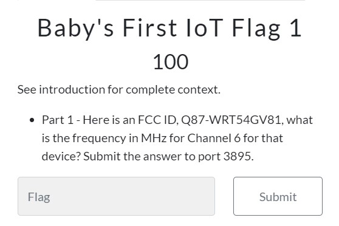
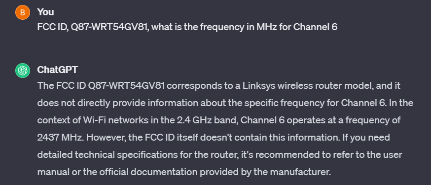
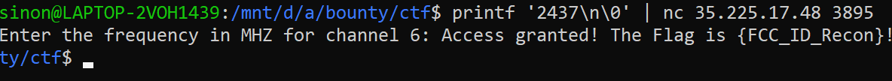

# Baby’s First IoT Flag 1
> Part 1 - Here is an FCC ID, Q87-WRT54GV81, what is the frequency in MHz for Channel 6 for that device? Submit the answer to port 3895.

## About the Challenge

We are given some FCC ID Q87-WRT54GV81, which is likely is a router number



## How to Solve

We can just goes to chatGPT and asked them the MHz for Channel 6 like this



It seems we got 2437 for the MHz, and next we can submit it to port 3895



```
{FCC_ID_Recon}
```