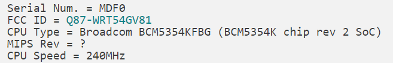
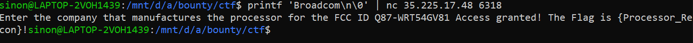

# Baby’s First IoT Flag 2
> Part 2 - What company makes the processor for this device? https://fccid.io/Q87-WRT54GV81/Internal-Photos/Internal-Photos-861588. Submit the answer to port 6318.

## About the Challenge

We just given some link to a report for internal photos of a wireless component and we need to find the company who’s make the processor


## How to Solve

To find the company who’s has built the processor, i found some [wiki](https://infodepot.fandom.com/wiki/Linksys_WRT54G_v8.1) for the router



It seems the company is `Broadcom`, then we try submit it



```
{Processor_Recon}
```