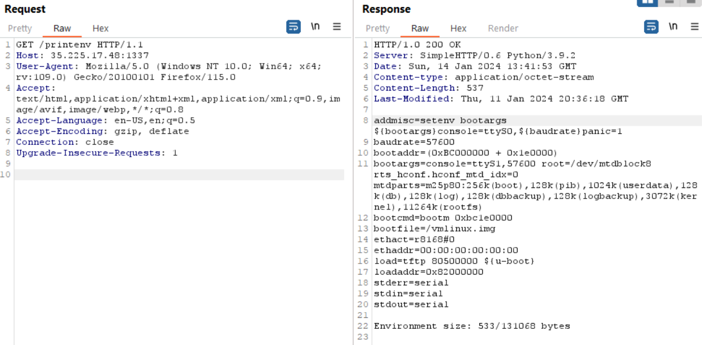
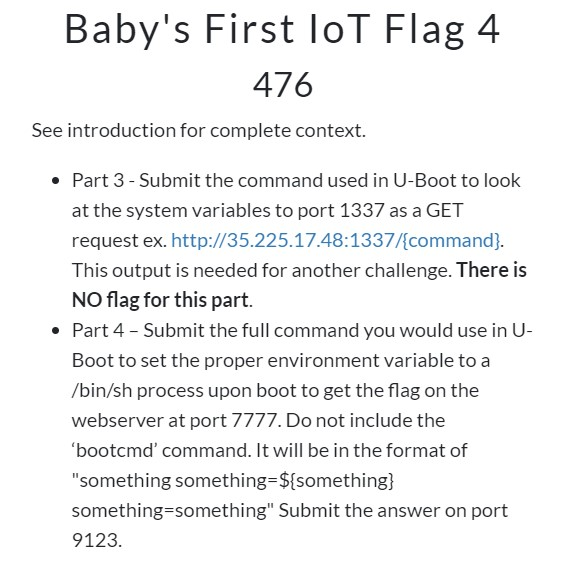
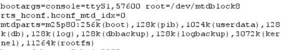
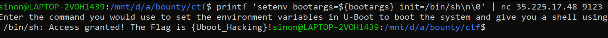

# Baby’s First IoT Flag 4
> Part 3 - Submit the command used in U-Boot to look at the system variables to port 1337 as a GET request ex. http://35.225.17.48:1337/{command}. This output is needed for another challenge. There is NO flag for this part.

> Part 4 – Submit the full command you would use in U-Boot to set the proper environment variable to a /bin/sh process upon boot to get the flag on the webserver at port 7777. Do not include the ‘bootcmd’ command. It will be in the format of “something something=${something} something=something” Submit the answer on port 9123.

## About the Challenge

As you can see the part 3 and part 4 is merged to one challenge, and for the instruction you can do the part 3 first.

Basic command for U-Boot `printenv` like this



And for the part 4, for conclusion we just need trying to init a shell from the part 3 output



## How to Solve

We read the description and we are prohibited to use `bootcmd` command, so the alternative is using `bootargs`, because we given some format hint is following like this

`something something=${something} something=something`

To set the environment we can use `setenv` at the start, if you read again the output of part 3 there are already a variable that load some environment



Then we can make this `bootargs=$bootargs`, for init a shell we use `init=/bin/sh` so we merged up like this

`setenv bootargs=${bootargs} init=/bin/sh`

Submit the answer



```
{Uboot_Hacking}
```