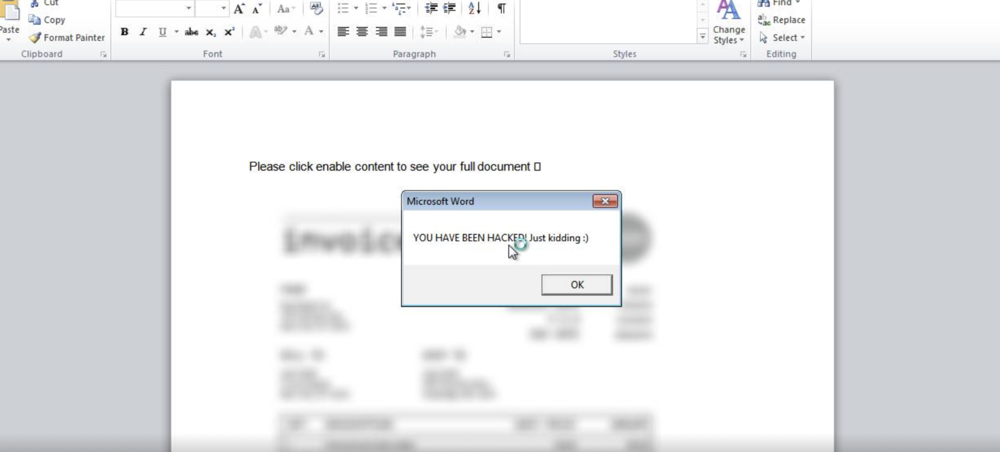
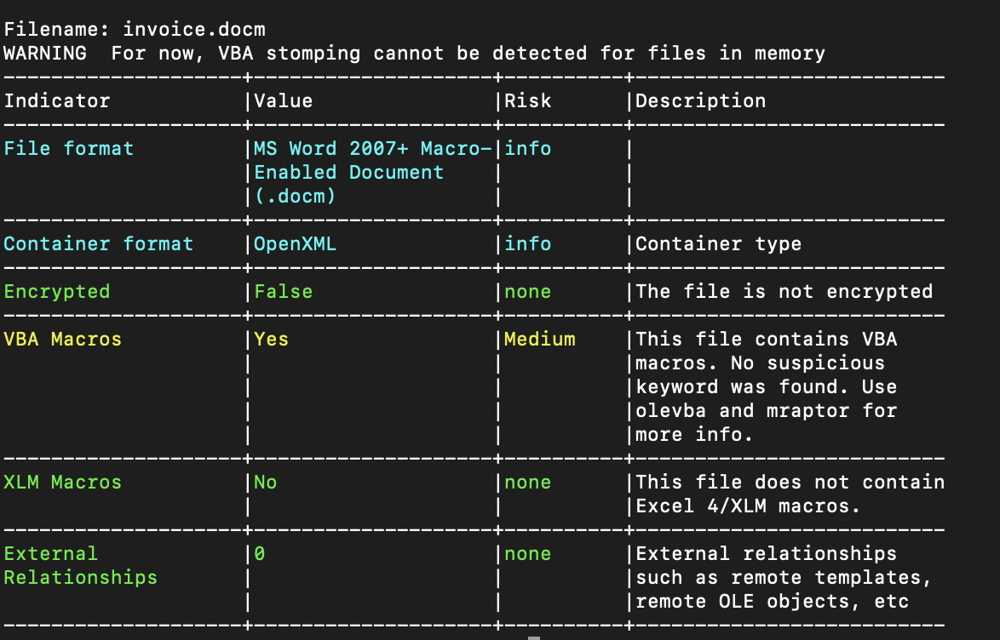
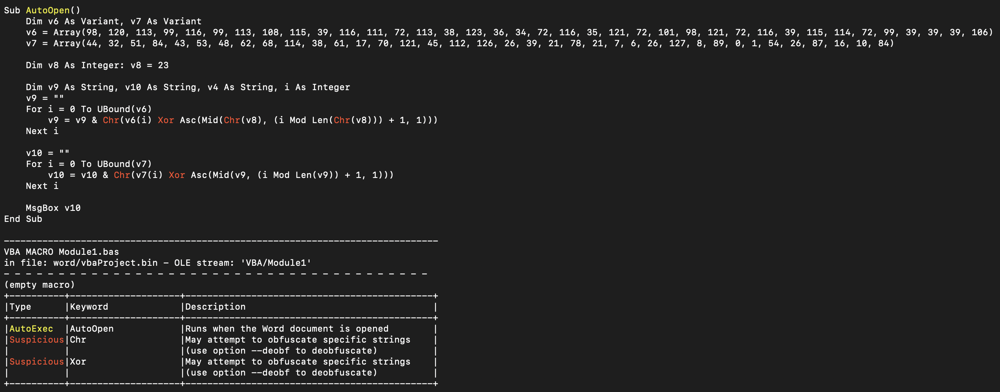

# EnableMe
> You've received a confidential document! Follow the instructions to unlock it.

> Note: This is not malware

## About the Challenge
We got a document file called `invoice.docm` (You can download the file [here](invoice.docm)) and when we attempted to open it, an alert appeared stating that our device has been hacked



## How to Solve?
Detect the file first using `oleid`. Here is the command

```bash
oleid invoice.docm
```



Hmm, there's a VBA Macros script? Let's extract it using `olevba` command:

```
olevba invoice.docm
```



Change the `MsgBox v10` to `MsgBox v9` to print the flag or you can run this Python code (I asked ChatGPT to convert the VBA script to python :D)

```python
def auto_open():
    v6 = [98, 120, 113, 99, 116, 99, 113, 108, 115, 39, 116, 111, 72, 113, 38, 123, 36, 34, 72, 116, 35, 121, 72, 101, 98, 121, 72, 116, 39, 115, 114, 72, 99, 39, 39, 39, 106]
    v7 = [44, 32, 51, 84, 43, 53, 48, 62, 68, 114, 38, 61, 17, 70, 121, 45, 112, 126, 26, 39, 21, 78, 21, 7, 6, 26, 127, 8, 89, 0, 1, 54, 26, 87, 16, 10, 84]

    v8 = 23

    v9 = ""
    for i in range(len(v6)):
        v9 += chr(v6[i] ^ ord((chr(v8)[(i % len(chr(v8)))]) ))

    v10 = ""
    for i in range(len(v7)):
        v10 += chr(v7[i] ^ ord((v9[(i % len(v9))])))

    print(v9)

# Call the function
auto_open()
```

## Flag
```
uoftctf{d0cx_f1l35_c4n_run_c0de_t000}
```