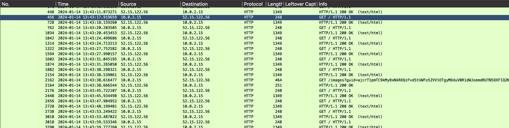
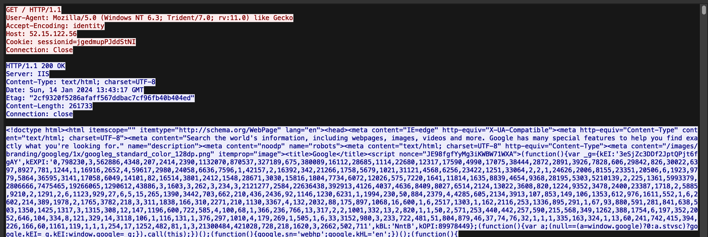
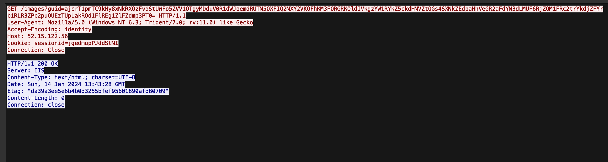

# Illusion
> Good Luck

## About the Challenge
We have a pcapng file that contains numerous HTTP requests. (You can download the pcapng file [here](traffic.pcapng))



## How to Solve?
There are endpoint `/images?guid` endpoint with blank response and in the `/` endpoint contain google search HTML code





And then I tried to search on GitHub about `/images?guid` endpoint and I found this [code](https://github.com/gsmith257-cyber/RandomTools/blob/b81d696ea4ddaafd045acd94ecc07302946d2c6d/trevorC2Decrypt.py#L51). Use the TrevorC2 traffic decryptor to decrypt the traffic, here is the output after decrypting the traffic

```
WARNING: No IPv4 address found on anpi1 !
WARNING: No IPv4 address found on anpi0 !
WARNING: more No IPv4 address found on en3 !
Decrypted response: magic_hostname=WINDOWS
Decrypted command: nothing
Decrypted command: nothing
Decrypted command: nothing
Decrypted command: nothing
Decrypted command: nothing
Decrypted command: nothing
Decrypted command: WINDOWS::::pwd
Decrypted response: WINDOWS::::
Path                    
----                    
C:\Users\analyst\Desktop


Decrypted command: nothing
Decrypted command: nothing
Decrypted command: nothing
Decrypted command: nothing
Decrypted command: WINDOWS::::curl https://uoftctf.org
Decrypted response: WINDOWS::::curl : The response content cannot be parsed because the Internet Explorer engine is not available, or Internet 
Explorer's first-launch configuration is not complete. Specify the UseBasicParsing parameter and try again. 
At line:1 char:2
+  curl https://uoftctf.org
+  ~~~~~~~~~~~~~~~~~~~~~~~~
    + CategoryInfo          : NotImplemented: (:) [Invoke-WebRequest], NotSupportedException
    + FullyQualifiedErrorId : WebCmdletIEDomNotSupportedException,Microsoft.PowerShell.Commands.InvokeWebRequestComman 
   d
 

Decrypted command: nothing
Decrypted command: nothing
Decrypted command: nothing
Decrypted command: nothing
Decrypted command: nothing
Decrypted command: WINDOWS::::cd ..
Decrypted response: WINDOWS::::
Decrypted command: WINDOWS::::pwd
Decrypted response: WINDOWS::::
Path            
----            
C:\Users\analyst


Decrypted command: nothing
Decrypted command: nothing
Decrypted command: nothing
Decrypted command: WINDOWS::::cd Desktop
Decrypted response: WINDOWS::::
Decrypted command: nothing
Decrypted command: WINDOWS::::New-Item "flag.txt"
Decrypted response: WINDOWS::::

    Directory: C:\Users\analyst\Desktop


Mode                 LastWriteTime         Length Name                                                                 
----                 -------------         ------ ----                                                                 
-a----         1/14/2024   8:44 AM              0 flag.txt                                                             


Decrypted command: nothing
Decrypted command: nothing
Decrypted command: nothing
Decrypted command: nothing
Decrypted command: nothing
Decrypted command: nothing
Decrypted command: nothing
Decrypted command: nothing
Decrypted command: WINDOWS::::echo "uoftctf{Tr3V0r_C2_1s_H4rd_T0_D3t3c7}" > flag.txt
Decrypted response: WINDOWS::::
Decrypted command: nothing
Decrypted command: nothing
Decrypted command: nothing
Decrypted command: nothing
Decrypted command: nothing
Decrypted command: nothing
Decrypted command: nothing
Decrypted command: nothing
Decrypted command: nothing
Decrypted command: nothing
Decrypted command: nothing
Decrypted command: nothing
Decrypted command: nothing
Decrypted command: nothing
Decrypted command: nothing
Decrypted command: nothing
Decrypted command: nothing
```

## Flag
```
uoftctf{Tr3V0r_C2_1s_H4rd_T0_D3t3c7}
```