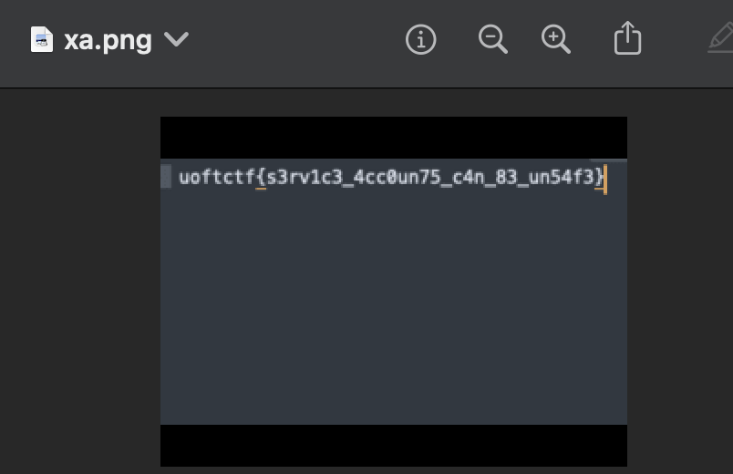

# Out of the Bucket 2
> This is a continuation of "Out of the Bucket". Take a look around and see if you find anything!

## About the Challenge
We got a exposed bucket GCP and inside the bucket there's a GCP credentials


## How to Solve?
First, we need to deploy Google Cloud SDK docker

```bash
docker run -it gcr.io/google.com/cloudsdktool/cloud-sdk:latest /bin/bash
```

And then inside the container, import the GCP credential

```bash
gcloud auth activate-service-account image-server@out-of-the-bucket.iam.gserviceaccount.com --key-file=file.json
gcloud config set project out-of-the-bucket
```

If we ran `gcloud storage list` command, we will see there are 2 buckets:


Hmmm we `flag-images` bucket looks interesting, try to download every file inside that bucket using this command

```
gsutil -m cp -r gs://flag-images .
```


This will download the file recursively and the flag is located in the `xa.png` file



## Flag
```
uoftctf{s3rv1c3_4cc0un75_c4n_83_un54f3}
```