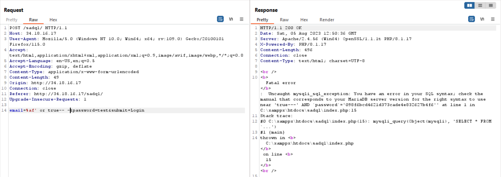

# SadQL
> I do not know whether I should say that or not, but you must bypass the login in any way, but remember that forcing does not always work. (Make Your Choice)

## About the Challenge
We were given a website (without the source code) and we need to bypass the login page


## How to Solve?
At first I tried to change to add `[]` on each parameter to see the error message. First i want to test `email` parameter


As you can see, the source code use `addslashes()` function in email parameter, now lets try to add `[]` in the password parameter


And in the password parameter, the source code using `md5()` function. And I searched on google about SQL injection if the program using `addslashes()` and I found this useful [website](http://www.securityidiots.com/Web-Pentest/SQL-Injection/addslashes-bypass-sql-injection.html). So I added `%af` into the SQL injection payload



But that's weird, why the website output was like this?

```
:  Uncaught mysqli_sql_exception: You have an error in your SQL syntax; check the manual that corresponds to your MariaDB server version for the right syntax to use near 'true---' AND `password`='098f6bcd4621d373cade4e832627b4f6'' at line 1 in C:\xamppx\htdocs\sadql\index.php:15
```

It looks like there are another filter that we needed to bypass again. I tried to stack the query, so for example from `or` to `oorr` and I changed the space into `/**/`. And in the end we also need to change the comment from `-- -` to `#`


```
adminASCWG{SqL_1Nj3ct1on_1s_V3Ry_Esay_ANd_Funyyyyyy!}
```