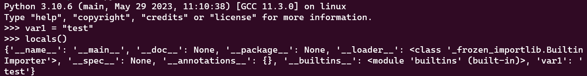
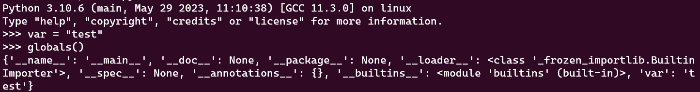
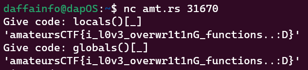

# Censorship
> I'll let you run anything on my python program as long as you don't try to print the flag or violate any of my other rules! Pesky CTFers...

## About the Challenge
We got a python script called `main.py`. Here is the content of `main.py`

```python
#!/usr/local/bin/python
from flag import flag

for _ in [flag]:
    while True:
        try:
            code = ascii(input("Give code: "))
            if "flag" in code or "e" in code or "t" in code or "\\" in code:
                raise ValueError("invalid input")
            exec(eval(code))
        except Exception as err:
            print(err)
```

So, this script will execute our input, but we can't input `flag`, `e`, `t`, and also `\`. We cannot use unicode character because of `ascii()`

## How to Solve?
To solve this problem, we don't need to execute an OS command. But how? As you can see the package `flag` was already imported into the code and also the value of flag was assigned to `_` variable.

```python
from flag import flag

for _ in [flag]:
    ...
```

Do you know there is a built-in function called `globals()` and `locals()`? This function returns a dictionary with all the global and local variables and symbols of the current program. For example:





So, to print the value of variable `flag` or `_`, we can use this payload

```python
globals()[flag]
globals()[_]
locals()[flag]
locals()[_]
```

Because we can't input `flag` in the program, we can only use the second and the fourth payload



```
amateursCTF{i_l0v3_overwr1t1nG_functions..:D}
```