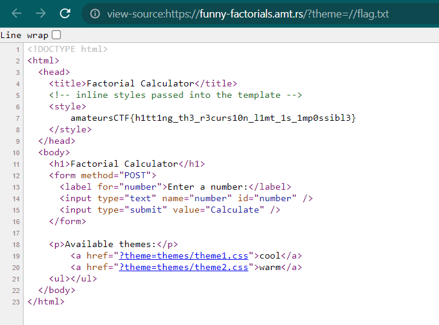

# funny factorials
> I made a factorials app! It's so fancy and shmancy. However factorials don't seem to properly compute at big numbers! Can you help me fix it?

## About the Challenge
We got a python code called `app.py`. Here is the content of `app.py`

```python
from flask import Flask, render_template, request
import sys

app = Flask(__name__)

def factorial(n):
    if n == 0:
        return 1
    else:
        try:
            return n * factorial(n - 1)
        except RecursionError:
            return 1

def filter_path(path):
    # print(path)
    path = path.replace("../", "")
    try:
        return filter_path(path)
    except RecursionError:
        # remove root / from path if it exists
        if path[0] == "/":
            path = path[1:]
        print(path)
        return path

@app.route('/')
def index():
    safe_theme = filter_path(request.args.get("theme", "themes/theme1.css"))
    f = open(safe_theme, "r")
    theme = f.read()
    f.close()
    return render_template('index.html', css=theme)

@app.route('/', methods=['POST'])
def calculate_factorial():
    safe_theme = filter_path(request.args.get("theme", "themes/theme1.css"))

    f = open(safe_theme, "r")
    theme = f.read()
    f.close()
    try:
        num = int(request.form['number'])
        if num < 0:
            error = "Invalid input: Please enter a non-negative integer."
            return render_template('index.html', error=error, css=theme)
        result = factorial(num)
        return render_template('index.html', result=result, css=theme)
    except ValueError:
        error = "Invalid input: Please enter a non-negative integer."
        return render_template('index.html', error=error, css=theme)

if __name__ == '__main__':
    sys.setrecursionlimit(100)
    app.run(host='0.0.0.0')
```

There is `/` endpoint that accepts 2 HTTP request method, POST and GET. The website retrieves the value of the `theme` parameter, read the content of the corresponding file, and then return it in the `index.html`. Here is the preview of the website


## How to Solve?
As you can see, we need to input the `flag` location into `theme` parameter to obtain the flag. But, there is a function called `filter_path` to prevent the path traversal vulnerability.

```python
def filter_path(path):
    # print(path)
    path = path.replace("../", "")
    try:
        return filter_path(path)
    except RecursionError:
        # remove root / from path if it exists
        if path[0] == "/":
            path = path[1:]
        print(path)
        return path
```

`filter_path` function takes a path string, removes any `../` sequences, and recursively continues filtering until no `../` remains. It also removes a leading forward slash if present, and then returns the filtered path. For example:

```
Our input: ../../../../test
The output: test
```

Even though you added `../` in the middle of payload, the function will remove it because of the recursion. But lets take a look again in this part

```python
# remove root / from path if it exists
if path[0] == "/":
    path = path[1:]
print(path)
return path
```

If the first character in our input is `/`, the function will remove the `/`. But if we double the `/` and the payload will be like this

```
//flag.txt
```

The function only remove the first character and the function will return `/flag.txt`.



```
amateursCTF{h1tt1ng_th3_r3curs10n_l1mt_1s_1mp0ssibl3}
```