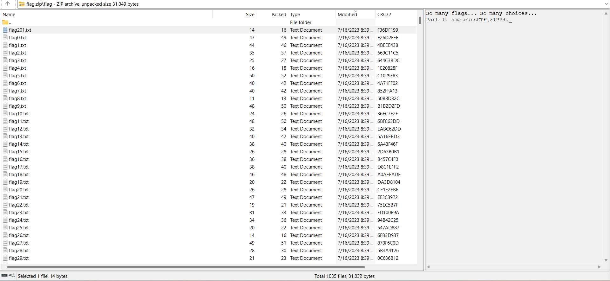
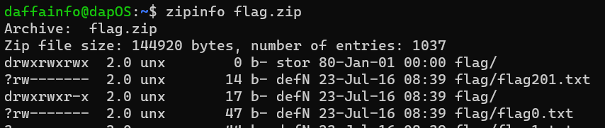

# zipper
> Stare into the zip and the zip stares back.

## About the Challenge
We have been given a zip file that contains a lot of `txt` files



## How to Solve?
First, you can get the first part by using `exiftool` and then check `comment` metadata


```
Part 1: amateursCTF{z1PP3d_
```

And then to obtain the second part, we need to check the information about the `zip` file first by using `zipinfo` command



Why are there two directories with the same name, and why does the second one have 17 bytes in it? If you unzip it manually, one of the directories will be overwritten; that's why we need to extract it differently.

To extract the flag, I created a python program to extract the file using a `file_` as a prefix

```python
import zipfile
z = zipfile.ZipFile('flag.zip')
for i, f in enumerate(z.filelist):
    f.filename = 'file_{0:03}'.format(i)
    z.extract(f)
```

And then use `strings` and `grep` to find the second part


```
Part 2: in5id3_4_
```

For the third part, you can use `exiftool` again and find `Zip File Comment` metadata


And for the last part, when you unzip the file you will notice there is a file with the same name


Open it and you will obtain the flag


```
amateursCTF{z1PP3d_in5id3_4_laY3r_0f_Zips}
```