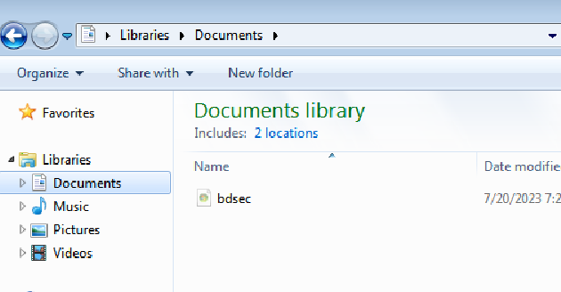
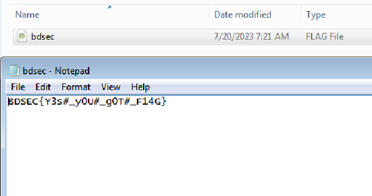

# Hacker destination file
> Second hacker who accessed physically he is quit smart but not too much.He set a path destination but file is missing.But it must be noticed that CPU power consume constrantly. You Must need to find that file which is missing from folder.

## About the Challenge
We need to find the missing file

## How to Solve?
First, we need to enable `Show hidden files, folders, and drives` first, and then go to `Documents` folder



There is a hidden file called `bdsec.FLAG`. Open the file to obtain the flag



```
BDSEC{Y3s#_y0U#_g0T#_F14G}
```