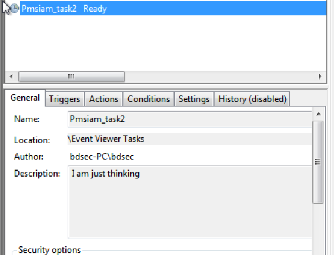
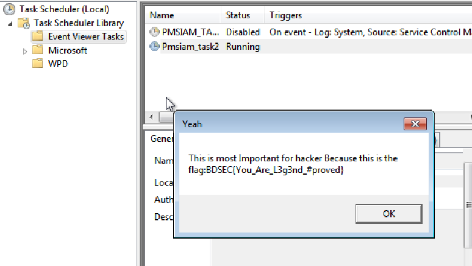

# Maintain shedule
> My friend highly maintains a schedule and takes regular actions. However, sometimes he forgets to do certain tasks. As a good friend, I want to help him by finding out about his work. Can you please assist me to find his today's work?

> Flag Format: BDSEC{FLAG}

## About the Challenge
As you can see the title is `Maintain shedule`. So we need to find the flag in `Task Scheduling` feature

## How to Solve?
If you the `Task Scheduling` feature, there is 1 task that's suspicious



Run the task and you will obtain the flag



```
BDSEC{You_Are_L3g3nd_#proved}
```