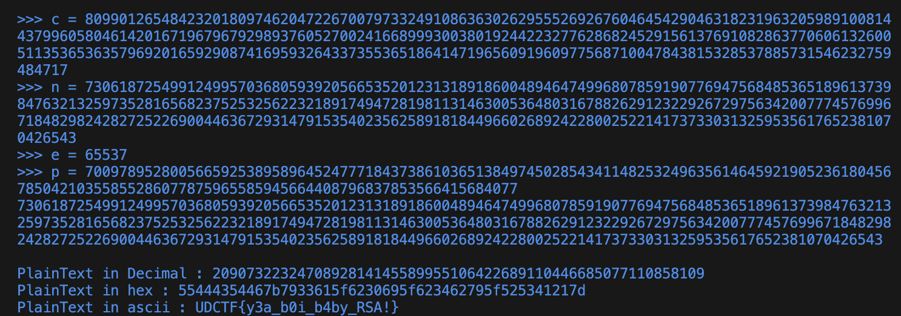

# RSA School 1st Grade
> First day of school!

## About the Challenge
We were given 2 files, `First_Grade.py` and `output.txt`. Here is the content of `First_Grade.py`

```python
from Crypto.Util.number import *
p=getPrime(512)
q=getPrime(512)
n=p*q
e=65537
msg=bytes_to_long(b'UDCTF{REDACTED}')
ct=pow(msg,e,n)
print(p)
print(n)
print(e)
print(ct)
```

And here is the content of `output.txt`

```
7009789528005665925389589645247771843738610365138497450285434114825324963561464592190523618045678504210355855286077875965585945664408796837853566415684077
73061872549912499570368059392056653520123131891860048946474996807859190776947568485365189613739847632132597352816568237525325622321891749472819811314630053648031678826291232292672975634200777457699671848298242827252269004463672931479153540235625891818449660268924228002522141737330313259535617652381070426543
65537
8099012654842320180974620472267007973324910863630262955526926760464542904631823196320598910081443799605804614201671967967929893760527002416689993003801924422327762868245291561376910828637706061326005113536536357969201659290874169593264337355365186414719656091960977568710047843815328537885731546232759484717
```

## How to Solve?
In this case im using [X-RSA](https://github.com/X-Vector/X-RSA) to recover the plaintext, and then choose the third option



```
UDCTF{y3a_b0i_b4by_RSA!}
```