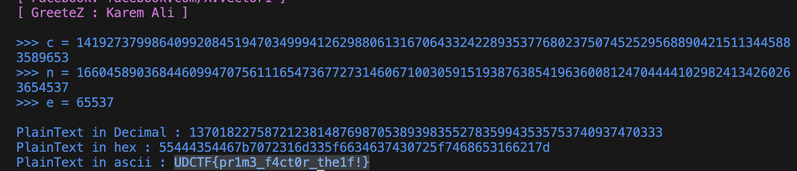

# RSA School 2nd Grade
> Ok a little tougher

## About the Challenge
We were given 2 files, `Second_Grade.py` and `output.txt`. Here is the content of `First_Grade.py`

```python
from Crypto.Util.number import *
n=166045890368446099470756111654736772731460671003059151938763854196360081247044441029824134260263654537
e=65537
msg=bytes_to_long(b'UDCTF{REDACTED}')
ct=pow(msg,e,n)
print(n)
print(e)
print(ct)
```

And here is the content of `output.txt`

```
166045890368446099470756111654736772731460671003059151938763854196360081247044441029824134260263654537
65537
141927379986409920845194703499941262988061316706433242289353776802375074525295688904215113445883589653
```

## How to Solve?
In this case im using [X-RSA](https://github.com/X-Vector/X-RSA) to recover the plaintext, and then choose the first option



```
UDCTF{pr1m3_f4ct0r_the1f!}
```