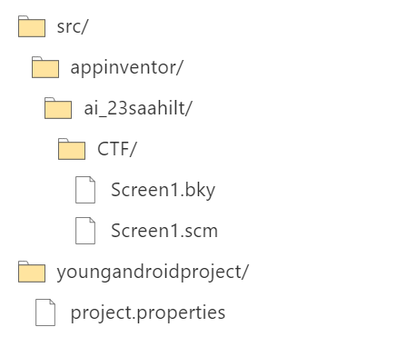

# Apps
> I made a small app when I was 9 years old first learning to code.

## About the Challenge
We were given a file (You can download the file [here](CTF.aia)) and we need to do reverse engineering in order to get the flag

## How to Solve?
Im using this [website](https://filext.com/file-extension/AIA) to analyze the file. And we got this structure



Read the `Screen1.bky` file to obtain the flag


```
bucket{M1T_4PP_1NV3NT0R_bf0285c53}
```