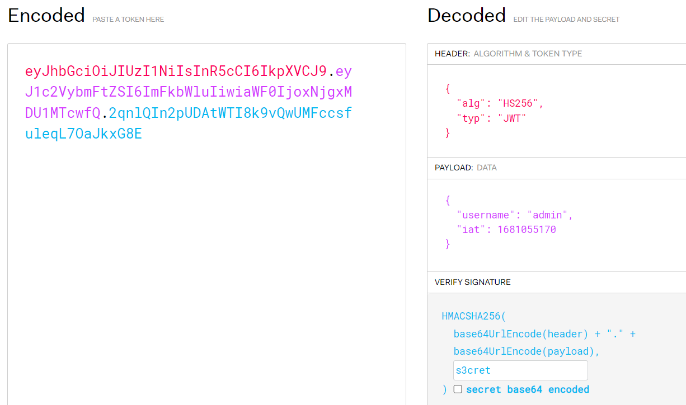

# Auth
> I just started learning about a new authentication method called JWT. This is my first website with it, could you check if its secure?

## About the Challenge
We have been given a plain website and we need to find the flag there


## How to Solve?
First, we need to create an account by using the `/register` endpoint.


And then login again and you will see JWT token on the HTTP response body


Copy that JWT token, and then try to brute-force the key from the token (Without the key, we won't be able to modify the token's contents). In this case im using this [tool](https://github.com/Sjord/jwtcrack) (Especially `jwt2john` script). Im using this command to bruteforce the JWT token

```shell
python3 jwt2john.py eyJ...... > hash.txt
john -w=/usr/share/wordlist/rockyou.txt
```

First, we need to convert the JWT token to john format, and then johntheripper will bruteforce the token


After that, we know the key is `s3cret`. Now use https://jwt.io to change the username to `admin` and then set the key in the `VERIFY SIGNATURE` section



You will notice in the HTTP response header there is a header called `Info` and in the header written we need to access `/info` endpoint


and then in the HTTP response body we need to access `/validate` endpoint also we need to provide the JWT token that we have signed before


Now, go to the `/validate` endpoint and add the JWT token to the `token` parameter in order to obtain the flag.


```
bucket{1_l0v3_jwt!!!1!!!!1!!!!!1111!}
```