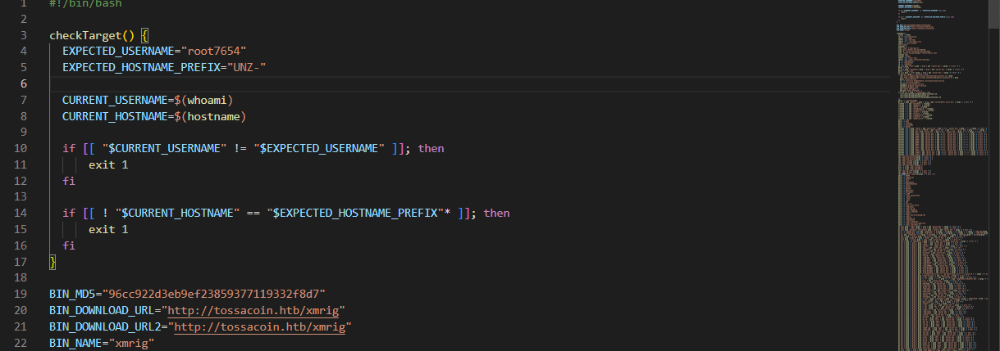
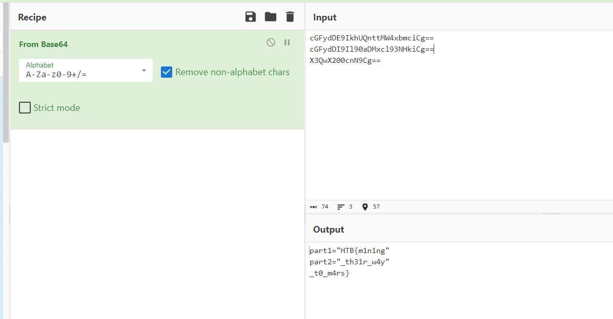

# Red Miners
> In the race for Vitalium on Mars, the villainous Board of Arodor resorted to desperate measures, needing funds for their mining attempts. They devised a botnet specifically crafted to mine cryptocurrency covertly. We stumbled upon a sample of Arodor's miner's installer on our server. Recognizing the gravity of the situation, we launched a thorough investigation. With you as its leader, you need to unravel the inner workings of the installation mechanism. The discovery served as a turning point, revealing the extent of Arodor's desperation. However, the battle for Vitalium continued, urging us to remain vigilant and adapt our cyber defences to counter future threats.

## About the Challenge
We were given a bash file (You can download the file (here)[forensics_red_miners.zip]). Here is the preview of the bash script:



## How to Solve?
The flag was split into several parts. So I found some interesting such as `base64` msg


I gather all the `base64` msg and then I decode it using `CyberChef`



```
HTB{m1n1ng_th31r_w4y_t0_m4rs}
```