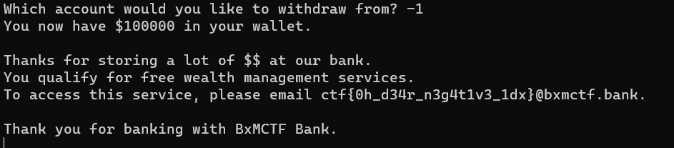

# Banking Issues
> You're at the bank with your girlfriend, she's upset
> She's going off about your empty bank balance
> 'Cause she doesn't get your money like I do

> Unfortunately, you only have $16 left in your bank account. Feeling too poor to even sing along to Taylor Swift in the car (after all, the radio needs power, which costs money), you wonder, if only there was a way for me to pull off a bank heist and get a hundred thousand dollars…

## About the Challenge
We have been given a `zip` file that contains a `Dockerfile` and a script python. Here is the content of the script

```python
#!/usr/local/bin/python

import os

balances = [10, 20, 50, 16, 29, 52, 100000]

PERMS_ADMIN = {
    "MAX_INDEX": len(balances) - 1
}

PERMS_AGENT = {
    "MAX_INDEX": len(balances) - 2
}

def main():
    perms = PERMS_AGENT
    wallet = 0
    idx = int(input("Which account would you like to withdraw from? "))
    if idx > perms["MAX_INDEX"]:
        print("Unauthorized")
        return
    wallet += balances[idx]
    balances[idx] = 0

    print(f"You now have ${wallet} in your wallet.\n")

    if wallet >= 100000:
        print("Thanks for storing a lot of $$ at our bank.")
        print("You qualify for free wealth management services.")
        print(f"To access this service, please email {os.getenv('FLAG')}@bxmctf.bank.\n")

    print("Thank you for banking with BxMCTF Bank.")


if __name__ == "__main__":
  main()
```

This script simulates a basic banking system where users can withdraw money from specific accounts, and if their wallet balance reaches >= 100000, they will obtain the flag.

## How to Solve?
To solve this problem im inputting `-1` because as you can see in this line

```python
balances = [10, 20, 50, 16, 29, 52, 100000]
..
..
    idx = int(input("Which account would you like to withdraw from? "))
    if idx > perms["MAX_INDEX"]:
        print("Unauthorized")
        return
    wallet += balances[idx]
    balances[idx] = 0
```

In the given script, the value of the wallet can be controlled by providing an index as input. If we input `-1` as the index, the code will access:

```
balances[-1] == 100000
```

So, our wallet balance will be set to 10000



```
ctf{0h_d34r_n3g4t1v3_1dx}
```