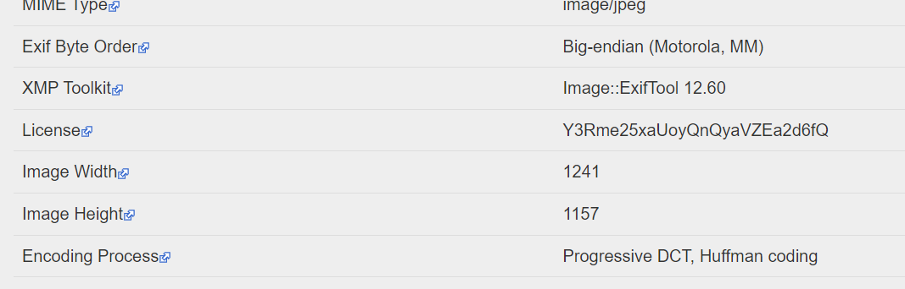

# Selfie
> One day, clides secretly plugged a rubber ducky into Claudio Pacheco's laptop and gained control. While browsing through his files, he found this selfie which contains some secret information.

> Can you help him find the secret information hidden in the selfie?

## About the Challenge
We were given a `zip` file that contains an image and we need to find the flag inside the image

## How to Solve?
To solve this problem, we can use `exiftool` to check the metadata of the file. And as you can see there is weird metadata called `License`



Decode the msg using `Base64` to read the flag


```
ctf{nqiJ2Bt2iVDkgz}
```