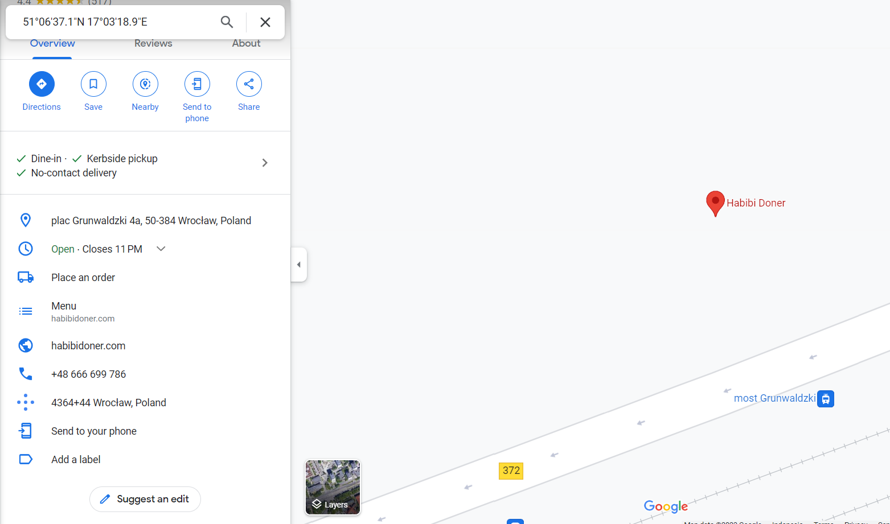

# Street View
> One day, clides was doing some detective work to try to catch the person who stole the 2 rubber duckies from the BxMCTF prize pool. He was doing some OSINT and he stumbled upon this street view image from ClaudsVille on Dread. Apparently, this image was sent from the thief.

> Can you help clides to find out where the image was taken?
 
> Submit the domain name of the company that owns the building as the flag, wrapped in ctf{}

## About the Challenge
We have been given an image file and we need to submit the domain name of the company

## How to Solve?
As usual, check the metadata of the image first


As you can see there are 2 unique metadata called `Latitude` and `Longitude`. Now go to Google Maps and go to that location, check the owner of the building and get the domain name



```
ctf{walmart.ca}
```