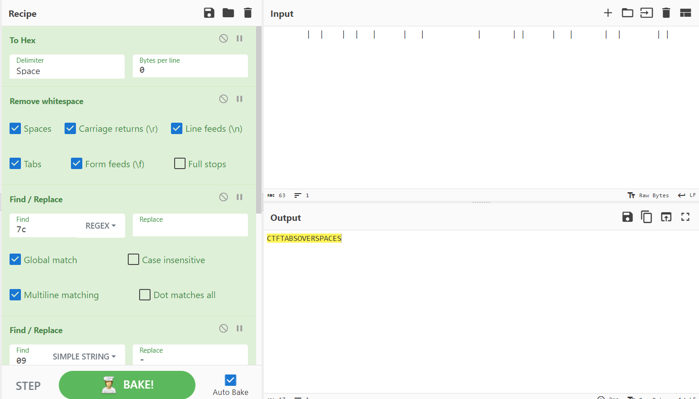

# Where Snakes Die
> The flag to this challenge is all lowercase, with no underscores.

## About the Challenge
We have been given a zip file that contains a `txt` file, here is the content of the file

```
	 	 |	|  	 |	| 	|	   |   |			|   	| | 	 |   | 		 | 	|	 	 | |   
```

Looks weird right?

## How to Solve?
If we convert the msg to `hex`, you will see something like this

```
09 20 09 20 7c 09 7c 20 20 09 20 7c 09 7c 20 09 7c 09 20 20 20 7c 20 20 20 7c 09 09 09 7c 20 20 20 09 7c 20 7c 20 09 20 7c 20 20 20 7c 20 09 09 20 7c 20 09 7c 09 20 09 20 7c 20 7c 20 20 20
```

Now, convert `20` to `.` and `09` to `-`. And how about `7c`? Change it to space. You will something like this

```
-.-. - ..-. - .- -... ... --- ...- . .-. ... .--. .- -.-. . ...
```

Decode the morse code to read the flag



```
ctf{tabsoverspaces}
```