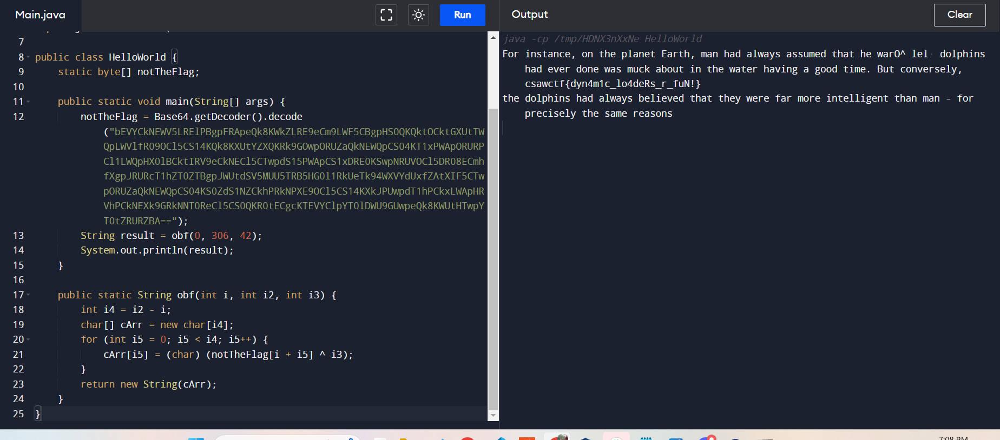

# AndroidDropper
> This app does nothing!

> dropper.apk sha256sum: aaf49dcee761d13da52a95f86b7b92596e7b63c14d0a04bce5dd24c7927ecea9

## About the Challenge
We were given an `apk` file and we need to find the flag inside of it

## How to Solve?
We need to decompile the `.apk` first, you can use Jadx or you can use this [website](http://www.javadecompilers.com/apk) to decompile the file. And this is the source code of the application

```java
package com.example.dropper;

import android.app.AlertDialog;
import android.os.Bundle;
import android.os.StrictMode;
import android.util.Base64;
import dalvik.system.DexClassLoader;
import java.io.File;
import java.io.FileOutputStream;
import java.io.IOException;
import java.lang.reflect.InvocationTargetException;
import java.lang.reflect.Method;
import p010d.C0342l;

public class MainActivity extends C0342l {
    public final void onCreate(Bundle bundle) {
        Class<?> cls;
        Object obj;
        super.onCreate(bundle);
        setContentView((int) R.layout.activity_main);
        try {
            byte[] decode = Base64.decode("ZGV4CjAzNQAWORryq3+hLJ+yXt9y3L5lCBAqyp3c8Q6UBwAAcAAAAHhWNBIAAAAAAAAAANAGAAAoAAAAcAAAABMAAAAQAQAACwAAAFwBAAABAAAA4AEAABAAAADoAQAAAQAAAGgCAAAMBQAAiAIAAPYDAAD4AwAAAAQAAA4EAAARBAAAFAQAABoEAAAeBAAAPQQAAFkEAABzBAAAigQAAKEEAAC+BAAA0AQAAOcEAAD7BAAADwUAAC0FAAA9BQAAVwUAAHMFAACHBQAAigUAAI4FAACSBQAAlgUAAJ8FAACnBQAAswUAAL8FAADIBQAA2AUAAPIFAAD+BQAAAwYAABMGAAAkBgAALgYAADUGAAADAAAABwAAAAgAAAAJAAAACgAAAAsAAAAMAAAADQAAAA4AAAAPAAAAEAAAABEAAAASAAAAEwAAABQAAAAVAAAAFgAAABgAAAAZAAAABAAAAAUAAAAAAAAABAAAAAoAAAAAAAAABQAAAAoAAADMAwAABAAAAA0AAAAAAAAABAAAAA4AAAAAAAAAFgAAABAAAAAAAAAAFwAAABAAAADYAwAAFwAAABAAAADgAwAAFwAAABAAAADoAwAAFwAAABAAAADwAwAABgAAABEAAADoAwAAAQARACEAAAABAAUAAQAAAAEAAQAeAAAAAQACACIAAAADAAcAAQAAAAMAAQAlAAAABgAGAAEAAAAIAAUAJAAAAAkABQABAAAACgAJAAEAAAALAAUAGgAAAAsABQAcAAAACwAAAB8AAAAMAAgAAQAAAAwAAwAjAAAADgAKABsAAAAPAAQAHQAAAAEAAAABAAAACQAAAAAAAAACAAAAuAYAAJYGAAAAAAAABAAAAAMAAgCoAwAASwAAAAAAIgAMABoBIABwIAwAEABuEA0AAAAMAB8ACwBuEAkAAAAiAQMAIgIGAG4QCwAAAAwDcCAFADIAcCADACEAbhAEAAEADAFuEAoAAAAoDA0BKB8NAW4QBgABAG4QCgAAABoBAABxAA8AAAAMAG4gDgAQAAwAaQAAABMAEwETATIBEwIqAHEwAgAQAgwAEQBuEAoAAAAnAQAADgAAABUAAQAqAAAAAwAFAAJ/CCknACcABwADAAIAAAC/AwAAGQAAALFFI1ASABIBNVEPAGICAACQAwQBSAICA7dijiJQAgAB2AEBASjyIgQKAHAgCAAEABEEAAABAAEAAQAAAKQDAAAEAAAAcBAHAAAADgAKAA4AEQAOHnhqPOFOPBwpHj08LqamAnkdPAAnAwAAAA48PKM+AAAAAwAAAAAAAAAAAAAAAQAAAAUAAAABAAAABwAAAAEAAAAKAAAAAQAAABIAAAAGPGluaXQ+AAxEcm9wcGVkLmphdmEAAUkAAUwABExJSUkAAkxMAB1MY29tL2V4YW1wbGUvZHJvcHBlZC9Ecm9wcGVkOwAaTGRhbHZpay9hbm5vdGF0aW9uL1Rocm93czsAGExqYXZhL2lvL0J1ZmZlcmVkUmVhZGVyOwAVTGphdmEvaW8vSU9FeGNlcHRpb247ABVMamF2YS9pby9JbnB1dFN0cmVhbTsAG0xqYXZhL2lvL0lucHV0U3RyZWFtUmVhZGVyOwAQTGphdmEvaW8vUmVhZGVyOwAVTGphdmEvbGFuZy9FeGNlcHRpb247ABJMamF2YS9sYW5nL09iamVjdDsAEkxqYXZhL2xhbmcvU3RyaW5nOwAcTGphdmEvbmV0L0h0dHBVUkxDb25uZWN0aW9uOwAOTGphdmEvbmV0L1VSTDsAGExqYXZhL25ldC9VUkxDb25uZWN0aW9uOwAaTGphdmEvdXRpbC9CYXNlNjQkRGVjb2RlcjsAEkxqYXZhL3V0aWwvQmFzZTY0OwABVgACVkwAAltCAAJbQwAHY29ubmVjdAAGZGVjb2RlAApkaXNjb25uZWN0AApnZXREZWNvZGVyAAdnZXRGbGFnAA5nZXRJbnB1dFN0cmVhbQAYaHR0cDovL21pc2MuY3Nhdy5pbzozMDAzAApub3RUaGVGbGFnAANvYmYADm9wZW5Db25uZWN0aW9uAA9wcmludFN0YWNrVHJhY2UACHJlYWRMaW5lAAV2YWx1ZQBXfn5EOHsiY29tcGlsYXRpb24tbW9kZSI6ImRlYnVnIiwiaGFzLWNoZWNrc3VtcyI6ZmFsc2UsIm1pbi1hcGkiOjEsInZlcnNpb24iOiIyLjEuNy1yMSJ9AAICASYcARgEAQADAAAIAIGABIwHAQmIBQEJyAYAAAAAAAABAAAAjgYAAKwGAAAAAAAAAQAAAAAAAAABAAAAsAYAABAAAAAAAAAAAQAAAAAAAAABAAAAKAAAAHAAAAACAAAAEwAAABABAAADAAAACwAAAFwBAAAEAAAAAQAAAOABAAAFAAAAEAAAAOgBAAAGAAAAAQAAAGgCAAABIAAAAwAAAIgCAAADIAAAAwAAAKQDAAABEAAABQAAAMwDAAACIAAAKAAAAPYDAAAEIAAAAQAAAI4GAAAAIAAAAQAAAJYGAAADEAAAAgAAAKwGAAAGIAAAAQAAALgGAAAAEAAAAQAAANAGAAA=", 0);
            FileOutputStream openFileOutput = openFileOutput("dropped.dex", 0);
            openFileOutput.write(decode);
            openFileOutput.flush();
            openFileOutput.close();
        } catch (IOException e) {
            e.printStackTrace();
        }
        StrictMode.setThreadPolicy(new StrictMode.ThreadPolicy.Builder().permitAll().build());
        File file = new File(getFilesDir(), "dropped.dex");
        Method method = null;
        try {
            cls = new DexClassLoader(file.getAbsolutePath(), getCacheDir().getAbsolutePath(), (String) null, getClassLoader()).loadClass("com.example.dropped.Dropped");
        } catch (ClassNotFoundException e2) {
            e2.printStackTrace();
            cls = null;
        }
        try {
            obj = cls.newInstance();
        } catch (IllegalAccessException | InstantiationException e3) {
            e3.printStackTrace();
            obj = null;
        }
        try {
            method = cls.getMethod("getFlag", (Class[]) null);
        } catch (NoSuchMethodException e4) {
            e4.printStackTrace();
        }
        try {
            method.invoke(obj, new Object[0]);
        } catch (IllegalAccessException | InvocationTargetException e5) {
            e5.printStackTrace();
        }
        file.delete();
        AlertDialog.Builder builder = new AlertDialog.Builder(this);
        builder.setMessage("test");
        builder.show();
        finish();
        System.exit(0);
    }
}
```

First, the app decodes a Base64-encoded string, representing a DEX file, and writes it to a file named `dropped.dex`. This dynamic loading of a DEX file is a technique sometimes used for code injection or dynamic class loading in Android applications.

After that, it sets a permissive thread policy using StrictMode and retrieves the file containing the DEX code. It then attempts to load a class named `com.example.dropped.Dropped` from the DEX file using a DexClassLoader. If successful, it creates an instance of this class and attempts to invoke a method called `getFlag` on it. This part suggests that the DEX file likely contains some dynamic functionality or logic to be executed.

Finally, the code deletes the DEX file, displays a simple test message in an alert dialog, finishes the activity, and exits the application using `System.exit(0)`. Let's decode the base64-encoded string and decompile the DEX file (You can use this [website](https://www.decompiler.com/) to decompile the file)

```java
package com.example.dropped;

import java.io.BufferedReader;
import java.io.IOException;
import java.io.InputStreamReader;
import java.net.HttpURLConnection;
import java.net.URL;
import java.util.Base64;

public class Dropped {
    static byte[] notTheFlag;

    /* JADX INFO: finally extract failed */
    public static String getFlag() throws IOException {
        String str;
        HttpURLConnection httpURLConnection = (HttpURLConnection) new URL("http://misc.csaw.io:3003").openConnection();
        try {
            httpURLConnection.connect();
            str = new BufferedReader(new InputStreamReader(httpURLConnection.getInputStream())).readLine();
            httpURLConnection.disconnect();
        } catch (Exception e) {
            e.printStackTrace();
            httpURLConnection.disconnect();
            str = "";
        } catch (Throwable th) {
            httpURLConnection.disconnect();
            throw th;
        }
        notTheFlag = Base64.getDecoder().decode(str);
        return obf(275, 306, 42);
    }

    public static String obf(int i, int i2, int i3) {
        int i4 = i2 - i;
        char[] cArr = new char[i4];
        for (int i5 = 0; i5 < i4; i5++) {
            cArr[i5] = (char) (notTheFlag[i + i5] ^ i3);
        }
        return new String(cArr);
    }
}
```

This Java code defines a class called `Dropped` with a method `getFlag` that fetches data from http://misc.csaw.io:3003, decodes it, and stores it in memory. There's also a method `obf()` that decrypts a portion of this data using a secret key. If we run the program, the output is `for precisely the same reasons`. And to obtain the flag, set the obf parameter from `275` to `0`. Here is the source code I used to obtain the flag

```java
import java.io.BufferedReader;
import java.io.IOException;
import java.io.InputStreamReader;
import java.net.HttpURLConnection;
import java.net.URL;
import java.util.Base64;

public class HelloWorld {
    static byte[] notTheFlag;

    public static void main(String[] args) {
        notTheFlag = Base64.getDecoder().decode("bEVYCkNEWV5LRElPBgpFRApeQk8KWkZLRE9eCm9LWF5CBgpHS0QKQktOCktGXUtTWQpLWVlfR09OCl5CS14KQk8KXUtYZXQKRk9GOwpORUZaQkNEWQpCS04KT1xPWApORURPCl1LWQpHX0lBCktIRV9eCkNECl5CTwpdS15PWApCS1xDRE0KSwpNRUVOCl5DR08ECmhfXgpJRURcT1hZT0ZTBgpJWUtdSV5MUU5TRB5HG0l1RkUeTk94WXVYdUxfZAtXIF5CTwpORUZaQkNEWQpCS04KS0ZdS1NZCkhPRkNPXE9OCl5CS14KXkJPUwpdT1hPCkxLWApHRVhPCkNEXk9GRkNNT0ReCl5CS0QKR0tECgcKTEVYClpYT0lDWU9GUwpeQk8KWUtHTwpYT0tZRURZBA==");
        String result = obf(0, 306, 42);
        System.out.println(result);
    }

    public static String obf(int i, int i2, int i3) {
        int i4 = i2 - i;
        char[] cArr = new char[i4];
        for (int i5 = 0; i5 < i4; i5++) {
            cArr[i5] = (char) (notTheFlag[i + i5] ^ i3);
        }
        return new String(cArr);
    }
}
```



```
csawctf{dyn4m1c_lo4deRs_r_fuN!}
```