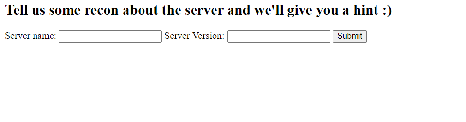
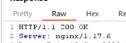
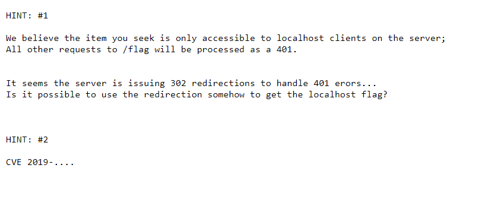
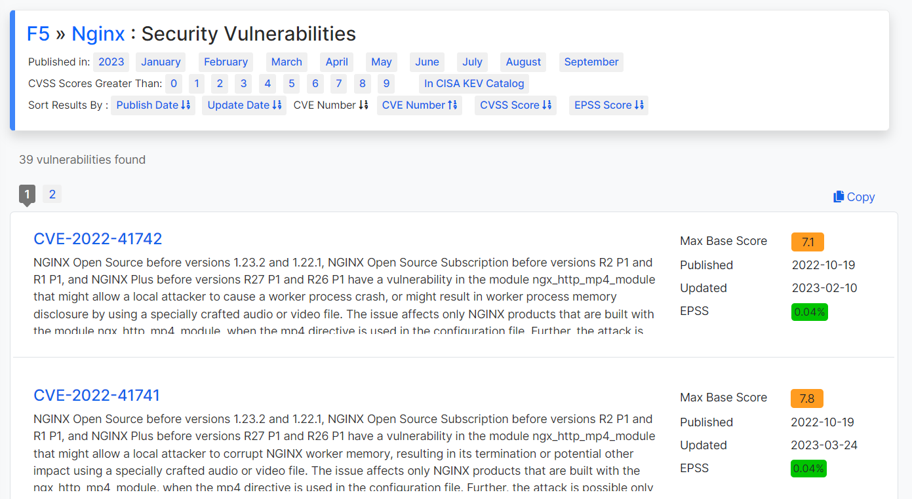
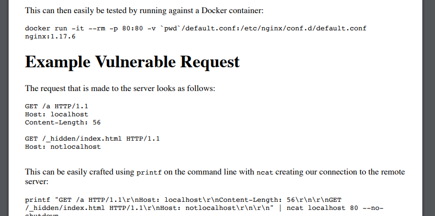
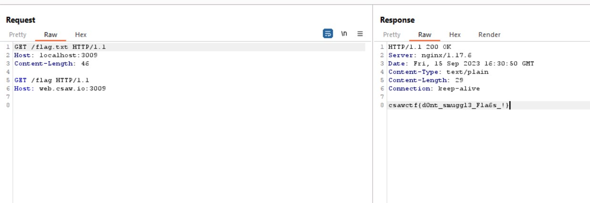

# Smug-Dino
> Don't you know it's wrong to smuggle dinosaurs... and other things?

## About the Challenge
We have been given a website, and this website have 2 endpoints, `/` and `/hint`. This is what the `/hint` endpoint looks like



Because we know about the web server information (You can find this information on HTTP response header)



Input `nginx` and `1.17.6` and voilà we got the hint



Hmmm, `CVE-2019-***` means this is a CVE related to Nginx considering that the Nginx used in this website is outdated

## How to Solve?
At first, i tried to find any CVEs related to nginx (You can also check the list [here](https://www.cvedetails.com/vulnerability-list/vendor_id-315/product_id-101578/F5-Nginx.html))



And I found this `CVE-2019-20372` and luckily we also found the proof of concept



And then i replicate the proof of concept in the website and finally we got the flag



```
csawctf{d0nt_smuggl3_Fla6s_!}
```