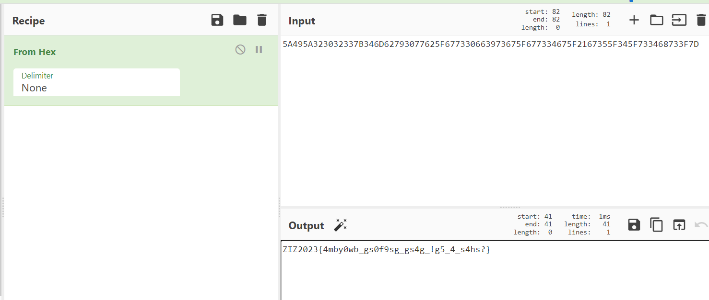
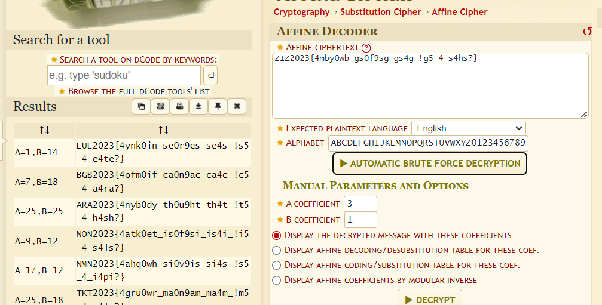

# @B4SH
> Ailee had just moved out to a boarding house in the countryside to escape the fast-paced and hectic city life. She was very excited to start her life with a new environment, she was very happy before she found out that the room she rented was very dark. Suddenly she found out 2 strange papers on the wall behind the door that says:

> "5A495A323032337B346D62793077625F677330663973675F677334675F2167355F345F733468733F7D".

> Help Ailee to find what's behind the text written on the paper.

## About the Challenge
We have been given a string containing numbers and capital letters

## How to Solve?
To solve this chall, we need to change the string from `hex` to `ASCII`



Followed by decoding the string using Affine Cipher where A = 25 and B = 25



```
ARA2023{4nyb0dy_th0u9ht_th4t_!t5_4_h4sh?}
```