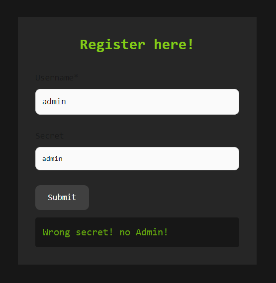
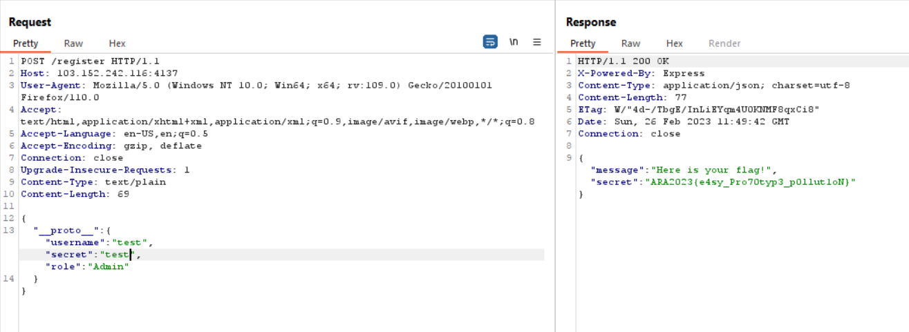

# Pollution
> Flag is on the admin side.

## About the Challenge
Given a website file along with the source code (You can get the source code [here](web_pollution_fix.zip)). On the website there is 1 endpoint named `/register` where if we can set the role to Admin and we know the secret web, then we can get the flag



## How to Solve?
To solve this chall, according to the title we have to do a pollution prototype. By using this reference https://portswigger.net/web-security/prototype-pollution, the request will look like this



```
ARA2023{e4sy_Pro70typ3_p0llut1oN}
```