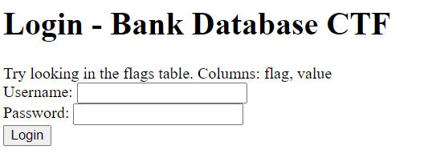

# Bank
> This is a bank. I hate php very much. Here

## About the Challenge
In the website there is a login form like this



## How to Solve?
This is SQL injection chall and we need to get the flag from the database, luckily the website showing us the query and the result on the website. For example I inputted `test/test` as the username and the password


And we know the flag is located on `flags` table and in that table there are 2 columns named `flag` and `value` So we can input the payload like this

```
Username: ' union select group_concat(flag, value),2,3 from flags-- -
Password: 
```

Because there is a filter on the `select` keyword, we can bypass that filter by using `selselectect`. And then read the flag on `flags` table. This is the final payload.

```
' union sselectelect group_concat(flag, value),2,3 from flags-- -
```


```
flag{3min3m_kind@_wa$hed}
```