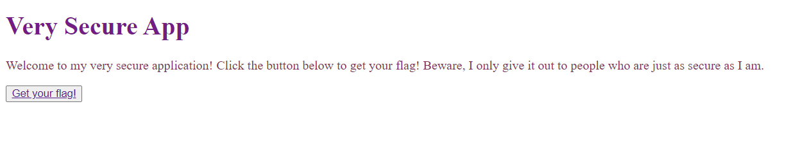

# Secure Platform
> Take a look at my super secure website. I only let people access the flag I hid there if they're just as secure as I am!

## About the Challenge
We need to find the flag on the website we have been given. The website is just a plain website and there is a button to get the flag



## How to Solve?
Press `Get your flag!` button and we will be redirected to a simple page like this


To solve this, we need to change the HTTP request header value named `sec-ch-ua-platform` from `Windows` to `INTEGRITY-178B`


```
flag{sh0uldv3_us3d_n4v1g4t0r}
```