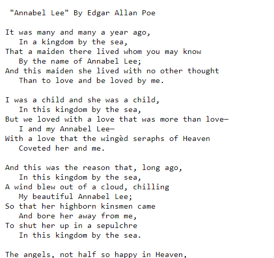
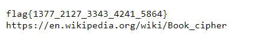
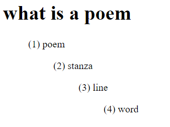

# Star Poet Blog
> oh dear... someone finding my password.txt i could not bear... but no fear... encrypted it i did to make it unclear... (*note: flag is all lowercase). Visit https://star-poet-blog.acmcyber.com.

## About the Challenge
We have been given a plain website like this


If we open the poems link, the website given us some poem i think? (The endpoint is `https://web/archive/annabel_lee.txt`)



## How to Solve?
If we check the description of the flag, we need to read the content of `password.txt`. So we can easily just access `https://star-poet-blog.acmcyber.com/archive/password.txt`



Im using `dcode.fr` website to decipher the flag cipher but the tool didn't output anything. And then I tried to explore the website and I found an interesting information



So to get the flag, we need to explore all the poem on the website and we need each part of the flag. For example `1337` that means
* Poem: 1
* Stanza: 3
* Line: 3
* Word: 7

And then we know the first part of the flag is `sepulchre`. Try to find all the flag parts and we will get the final flag

```
flag{sepulchre_tombstone_spirit_grains_nevermore}
```