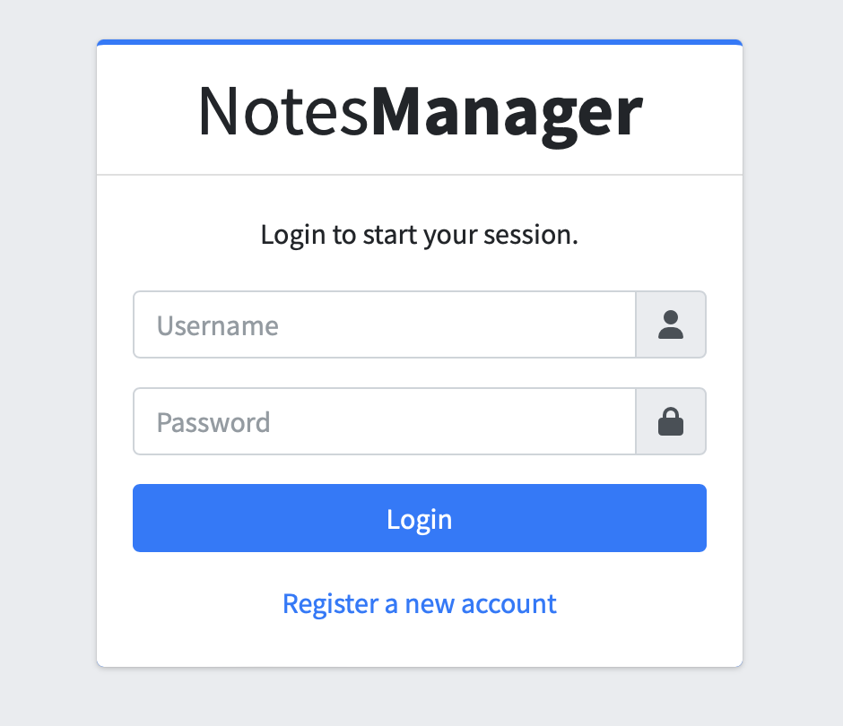
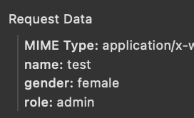
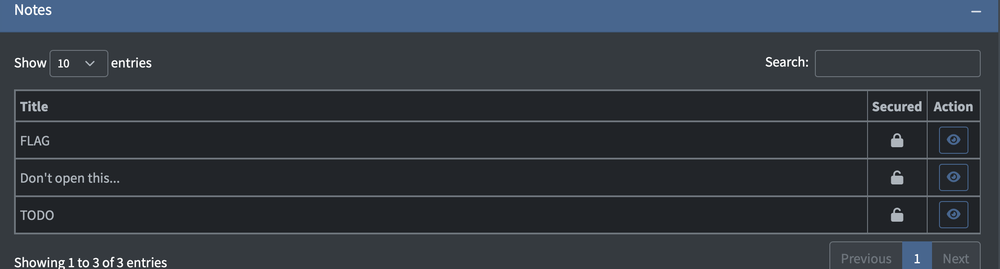
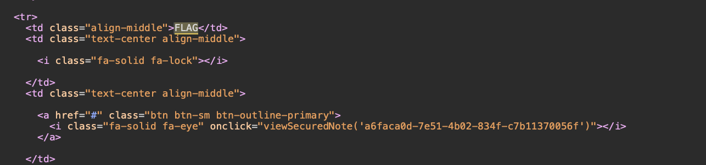
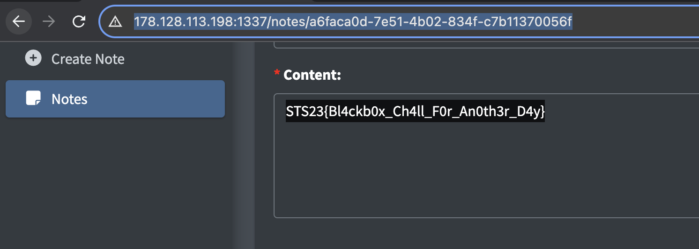

# Notes Manager

> You are a penetration tester hired by a small company who got their website hacked recently. They said the hacker somehow got administrative privilege to the website, but there were no logs indicated that an our main admin account was used in other IP Address else than our administrator IP Address. Can you help this company to find the vulnerabilities so that they can patch it ASAP?

## About the Challenge
We were given a website without a source code, and there are some functionality such as:
* Register
* Login
* Setting acount
* Create our note
* See our note
* Lock our note



## How to Solve?
To obtain the flag, we need to first change our role from `user` to `admin` in the settings menu. (When I solved this challenge, the author accidentally added a `role` parameter to the account settings form)



After obtaining the `admin` role, we need to check the locked note that contains the flag.



We can bypass it by accessing the note directly (There is a note UUID in the body).





```
STS23{Bl4ckb0x_Ch4ll_F0r_An0th3r_D4y}
```