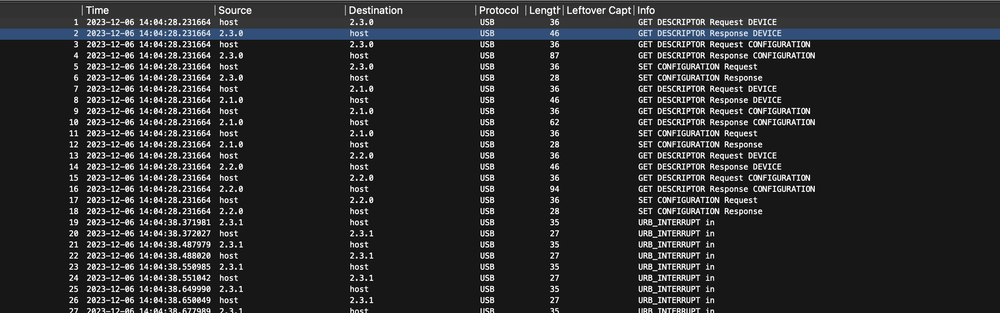
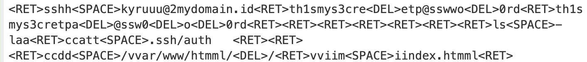

# keylogger

> So, here's the thing. I just came to the Internet caffee (warnet) and after several minutes using the computer, I found a strange process running in the backround. Then i found out it was a keylogger. Luckily I can stop the process and don't let the attacker get this keylogger file. Because i just logged in to my server before.

> flag = STS23{`<my server password>`}

## About the Challenge
We were given a pcapng file (You can downlod the file [here](log.pcapng)) and we need to find the flag inside this packet capture file



## How to Solve?
Im using this [writeup](https://ctftime.org/writeup/27675) as a reference because they have the same solution method. First filter the data first to get the usbhid data

```
((usb.transfer_type == 0x01) && (frame.len == 35)) && !(usb.capdata == 00:00:00:00:00:00:00:00)
```

And then put this filter into this [repository](https://github.com/WangYihang/UsbKeyboardDataHacker) to convert the usbhid data into a character and voila!



> `<DEL>` means we need to delete the character

```
STS23{th1smys3cretp@ssw0rd}
```