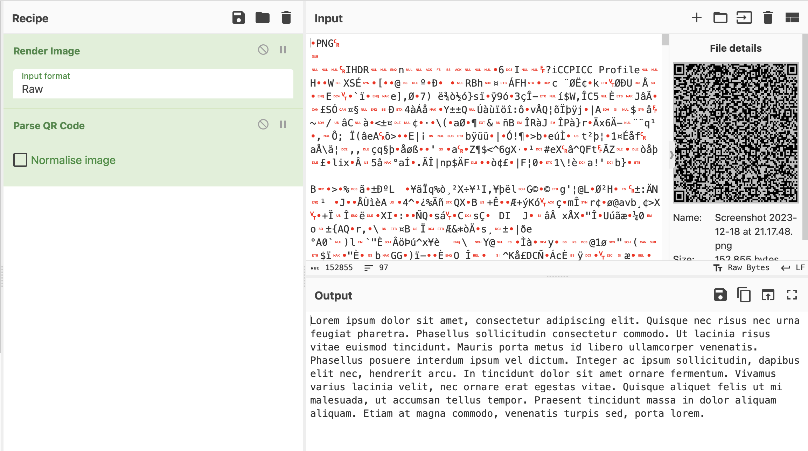
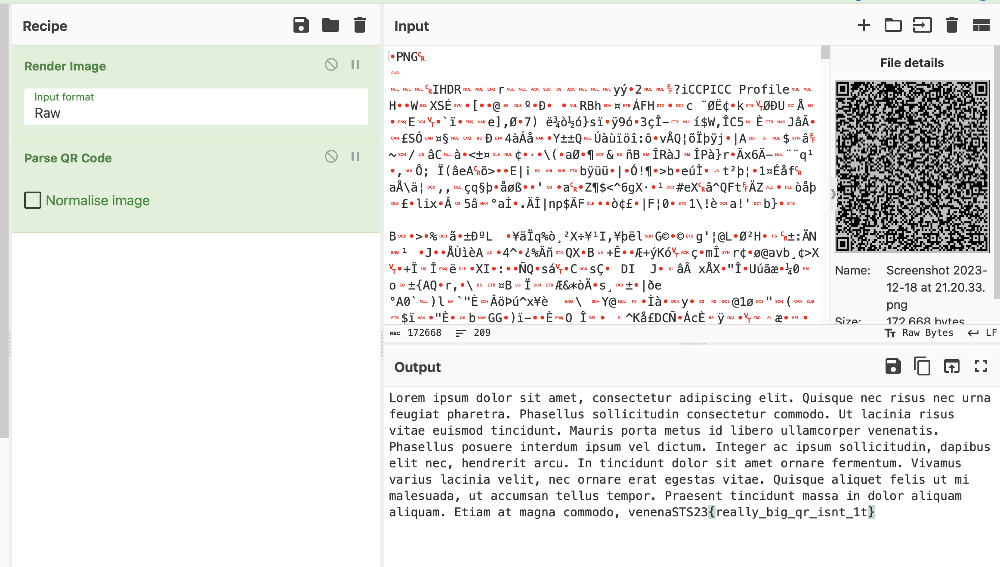

# pemanasan

> Is that a `qrcode`? why is it so big?

## About the Challenge
We were given a rar file (You can downlod the file [here](pemanasan.rar)). Inside the file, there were 2 files which is `whatistheDIFFerent` (Contain the diff between the new qr and old qr image) and we got `qr.new`. If we parse the qr new we got `Lorem ipsum ....` string



## How to Solve?
Use `patch` command and then parse the QR code again to obtain the flag

```bash
$ patch qr.new -i whatistheDIFFerent 
patching file qr.new
Reversed (or previously applied) patch detected!  Assume -R? [y] y
```


```
STS23{really_big_qr_isnt_it}
```