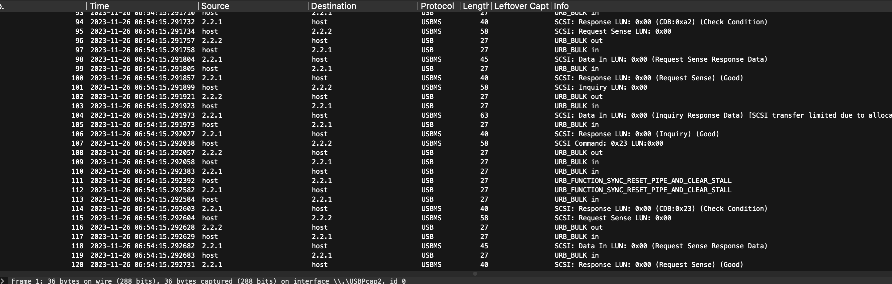

# sloppy

> So, I found an USB in my class, I took it and I put it in my laptop. Then i found interesting anime (the anime is in mp4) and rar file and I copied it on my laptop. When i tried to open the file it showed pop up that my computer has been comprimized and my laptop restared after 1 minutes and I immediately remove all file that've been copied to my computer. As an engineer i always capture usb traffic using wireshark. Please help me to figure out what's happening in my laptop.

> [download](https://drive.google.com/file/d/1JFQ2p1tRGp_s1rrHWX6glHP2r4nftjR7/view?usp=sharing)

> wrap your flag with STS23{`<value>`}

## About the Challenge
We were given a pcapng file (You can download the file using the link above), and we need to find the flag inside the packet capture file



As you can see, there are USB and USBMS protocol in the packet capture file

## How to Solve?
As we can see, there are a loot of usbms protocol and the author mention about "rar" file. So im using this command to extract every file and then put it into a JSON file

```bash
tshark -T json -x -Y usbms -r chall.pcapng > usbms.json
```

And then I tried to find a rar file using `grep` command (Rar! == 52617221)

```bash
cat usbms.json | grep '"52617221'
```

Okay we found it, and then I submitted the hex code into CyberChef


As you can see, there is a file with a `.bat` extension—hmm, weird. If you analyze the RAR file, this is the payload for `CVE-2023-38831`. And then I extracted the bat file and submitted into a sandbox malware online platform


```
STS23{C0mPrem1zed_d3sktop_h3h3}
```
