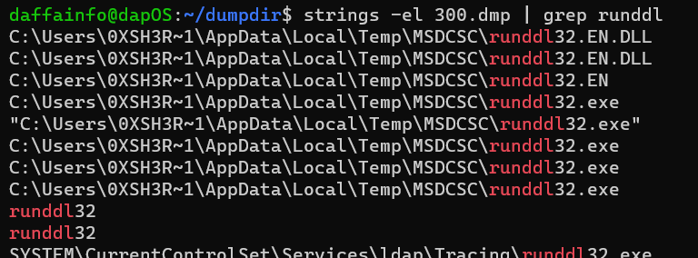

# Attaaaaack6
> Q6. What is the full path (including executable name) of the hidden executable?

> example : crew{C:\Windows\System32\abc.exe}

## About the Challenge
We got `raw` image and we need to find the location of the hidden executable

## How to Solve?
To solve this, we need to find the list of the file using `filescan` plugin. And then use `grep` command to find `runddl`. Here is the command that I used

```
vol.py -f /path/to/memdump.raw --profile=Win7SP1x86_23418 filescan | grep "runddl"
```


There is another way to solve this chall by using `dlllist` plugin or you can use `strings` and `grep` command to find the location path in the `300.dmp` file



```
crew{C:\Users\0XSH3R~1\AppData\Local\Temp\MSDCSC\runddl32.exe}
```