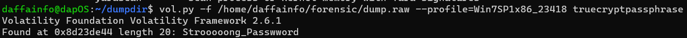

# Encrypt10n
> We made a memory dump on the criminal machine after entering the crime scene. Our investigator thought he was using encryption software to hide the secret. can you help me to detect it?

> Q1 : crew{password}

## About the Challenge
We got `raw` image and we need to find the password of an encrypted file

## How to Solve?
To solve this, we need to find the best volatility profile first using `imageinfo` plugin. Here is the command that I used to find the profile

```
vol.py -f /path/to/dump.raw imageinfo
```


Now we need to check the process list first using `pslist` plugin. Here is the command that I used to check the process list

```
vol.py -f /path/to/dump.raw --profile=Win7SP1x86_23418 pslist
```


You will notice there is a process called `TrueCrypt.exe`. TrueCrypt is a disk encryption software. Now, we know the encryption software, and we need to find the password. Luckily there is a plugin called `truecryptpassphrase` to find the TrueCrypt password. Here is the command that I used to get the TrueCrypt password



```
crew{Strooooong_Passwword}
```