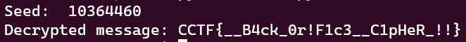

# Bagels
> The Blue Office's ingenious cipher, meticulously crafted for the prestigious CCTF, became an impenetrable enigma that left even the most seasoned cryptanalysts baffled.

## About the Challenge
We have been given a zip file (You can download the file [here]). And if you unzip the file, you will see there are 2 files called `blue_office.py` and `output.txt`. Here is the content of `blue_office.py`:

```python
#!/usr/bin/enc python3

import binascii
from secret import seed, flag

def gen_seed(s):
	i, j, k = 0, len(s), 0
	while i < j:
		k = k + ord(s[i])
		i += 1
	i = 0
	while i < j:
		if (i % 2) != 0:
			k = k - (ord(s[i]) * (j - i + 1))            
		else:
			k = k + (ord(s[i]) * (j - i + 1))
	
		k = k % 2147483647
		i += 1

	k = (k * j) % 2147483647
	return k

def reseed(s):
	return s * 214013 + 2531011

def encrypt(s, msg):
	assert s <= 2**32
	c, d = 0, s
	enc, l = b'', len(msg)
	while c < l:
		d = reseed(d)
		enc += (msg[c] ^ ((d >> 16) & 0xff)).to_bytes(1, 'big')
		c += 1
	return enc

enc = encrypt(seed, flag)
print(f'enc = {binascii.hexlify(enc)}')
```

This Python script is a basic encryption program. It imports the necessary modules and contains functions to generate a seed value, reseed the seed, and perform the encryption. The gen_seed function calculates a seed value based on a given string using a combination of addition, subtraction, and modulo operations. The reseed function updates the seed value using a mathematical formula. The encrypt function takes the seed and a message, iterates through each character of the message, and performs XOR operations with the seed-derived value. The encrypted output is stored and displayed in hexadecimal format. And if you check the `output.txt` file there is an encryted flag

```
enc = b'b0cb631639f8a5ab20ff7385926383f89a71bbc4ed2d57142e05f39d434fce'
```
## How to Solve?
To solve this chall, we need to brute the seed first, how? Because we know the format of the flag is `CCTF{` and we know the output of the encrypted flag. We need to try check the seed from 0 to xxxx and then check the encryted match with `b0cb631639`. After that we need to create another function to decrypt the message

```python
def decrypt(s, enc):
    assert s <= 2**32
    c, d = 0, s
    msg, l = b'', len(enc)
    while c < l:
        d = reseed(d)
        msg += (enc[c] ^ ((d >> 16) & 0xff)).to_bytes(1, 'big')
        c += 1
    return msg
```

The decrypt function takes a seed value and an encrypted message, reseeds the seed value, performs a bitwise XOR operation between each byte of the encrypted message and a derived value from the reseeded seed, and returns the decrypted message. And here the final script that i used to solve this chall

```python
#!/usr/bin/enc python3

import binascii

def gen_seed(s):
        i, j, k = 0, len(s), 0
        while i < j:
                k = k + ord(s[i])
                i += 1
        i = 0
        while i < j:
                if (i % 2) != 0:
                        k = k - (ord(s[i]) * (j - i + 1))
                else:
                        k = k + (ord(s[i]) * (j - i + 1))

                k = k % 2147483647
                i += 1

        k = (k * j) % 2147483647
        return k

def reseed(s):
        return s * 214013 + 2531011

def encrypt(s, msg):
        assert s <= 2**32
        c, d = 0, s
        enc, l = b'', len(msg)
        while c < l:
                d = reseed(d)
                enc += (msg[c] ^ ((d >> 16) & 0xff)).to_bytes(1, 'big')
                c += 1
        return enc

def decrypt(s, enc):
    assert s <= 2**32
    c, d = 0, s
    msg, l = b'', len(enc)
    while c < l:
        d = reseed(d)
        msg += (enc[c] ^ ((d >> 16) & 0xff)).to_bytes(1, 'big')
        c += 1
    return msg

seed = 0

for seeds in range(1, 2**32 + 1):
    enc = encrypt(seeds, b"CCTF{")
    if binascii.hexlify(enc) == b'b0cb631639':
        seed = seeds
        break

#enc = encrypt(10364460, b"CCTF{")
#print(f'enc = {binascii.hexlify(enc)}')

enc = binascii.unhexlify(b'b0cb631639f8a5ab20ff7385926383f89a71bbc4ed2d57142e05f39d434fce')

for char in range(256):
    dec = decrypt(seed, enc)
    if all(32 <= byte <= 126 or byte == 10 or byte == 13 for byte in dec):
        print(f"Decrypted message: {dec.decode('utf-8')}")
    seed += 1
```



```
CCTF{__B4ck_0r!F1c3__C1pHeR_!!}
```