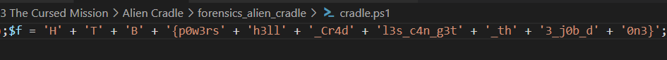

# Alien Cradle
> In an attempt for the aliens to find more information about the relic, they launched an attack targeting Pandora's close friends and partners that may know any secret information about it. During a recent incident believed to be operated by them, Pandora located a weird PowerShell script from the event logs, otherwise called PowerShell cradle. These scripts are usually used to download and execute the next stage of the attack. However, it seems obfuscated, and Pandora cannot understand it. Can you help her deobfuscate it?

## About the Challenge
We have been given a zip file (You can download the file [here](forensics_alien_cradle.zip)). If we unzip the file, there is a file called `cradle.ps1`

## How to Solve?
Open the powershell script using notepad / text editor. And then find variable `$f` to get the flag



```
HTB{p0w3rsh3ll_Cr4dl3s_c4n_g3t_th3_j0b_d0n3}
```