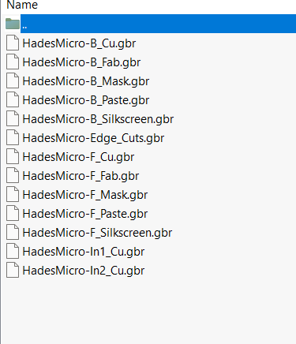
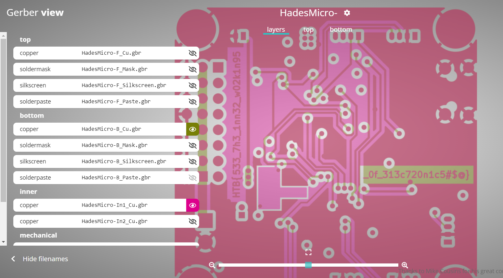

# Critical Flight
> Your team has assigned you to a mission to investigate the production files of Printed Circuit Boards for irregularities. This is in response to the deployment of nonfunctional DIY drones that keep falling out of the sky. The team had used a slightly modified version of an open-source flight controller in order to save time, but it appears that someone had sabotaged the design before production. Can you help identify any suspicious alterations made to the boards?

## About the Challenge
We were given a zip file and if we extract the file, we will see 13 files with `gbr` extension



## How to Solve?
To solve this chall, I'm using [Gerber Viewer Online](https://www.pcbway.com/project/OnlineGerberViewer.html) and upload all with `gbr` extension files there.



You can see the flags in the `HadesMicro-B_Cu.gbr` and `HadesMicro-In1_Cu.gbr` files

```
HTB{533_7h3_1nn32_w02k1n95_0f_313c720n1c5#$@}
```